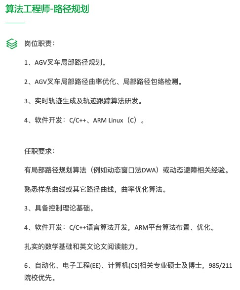
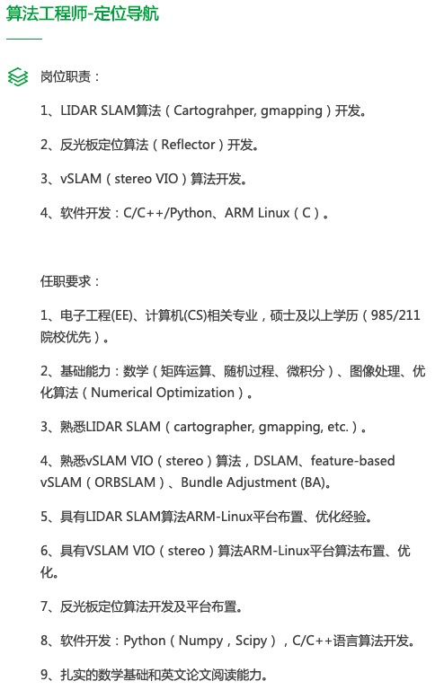

--4.21更新

## 美的-库卡机器人

### 调度

#### Junior Developer Fleet Management System 调度系统开发初级工程师

Key Responsibilities:
•         Develop and document new features
•         Design and implement tests
Key Qualifications:
•         Fluent in English
•         Software development background (preferably Java)
•         Bachelor or Master level in software engineering/computer science or relevant field
•         sharp analytical and problem-solving skills
•         Result oriented thinking
•         Knowledge of different path planning algorithms and approaches
•         Basic Knowledge of network architecture
•         Optional:

-        Experience with Microservice Architectures
-        Experience with service frameworks like osgi or Spring
-        experience with Docker, GRPC, GIT, Team City/Azure Devops
-        Linux knowledge

#### Professional Developer Fleet Management System 调度系统开发主任工程师

 Key Responsibilities:
•         Develop and document features for Fleet Management Systems
•         Design, extend and maintain architecture of Fleet Management Components
•         Design and implement tests
•         Be a leading part of software planning
•         Provide technical leadership
•         Define and align technical solutions across multi-national teams
•         Support long term plan and vision
•         Provide timely communications on significant issues or developments
Key Qualifications:
•         Fluent in English
•         Software development background (preferably Java)
•         Master level in software engineering/computer science or relevant field
•         At least 4 years of professional work experience in software engineering
•         sharp analytical and problem-solving skills
•         Result oriented thinking
•         Experience with different path planning algorithms and approaches
•         Experience with Microservice Architectures
•         Knowledge of network architecture
•         Linux knowledge
•         Optional:

-        Experience with Docker, GRPC, GIT, Team City/Azure Devops
-        Experience with service frameworks like osgi or Spring

### 运动控制

#### Junior Software Developer AGV Navigation AGV导航开发初级工程师

 Key Responsibilities:
•         develop robot control software in C++
•         develop and extend robot functionalities
•         Implement and extend new features for navigation
•         write unit and integration tests
•         documentation
Key Qualifications:
•         at least Bachelor or Master level in engineering/computer science or relevant field
•         C++ programming knowledge
•         ability to communicate in English
•         ability to work in a team
Optional:

-        Java knowledge
-        experience in real time operation systems
-        knowledge in microservice architectures
-        experience with Docker, GIT, Team City/Azure Devops
-        knowledge of robot control theory or navigation
-        Linux knowledge
-        Knowledge in Path Planning
-        Knowledge in Laser-SLAM
-        Knowledge in Visual SLAM
-        Knowledge in Computer Vision

### 导航

Junior Software Developer AGV Navigation AGV导航开发初级工程师
 Key Responsibilities:
•         develop robot control software in C++
•         develop and extend robot functionalities
•         Implement and extend new features for navigation
•         write unit and integration tests
•         documentation
Key Qualifications:
•         at least Bachelor or Master level in engineering/computer science or relevant field
•         C++ programming knowledge
•         ability to communicate in English
•         ability to work in a team
•         Optional:
-        Java knowledge
-        experience in real time operation systems
-        knowledge in microservice architectures
-        experience with Docker, GIT, Team City/Azure Devops
-        knowledge of robot control theory or navigation
-        Linux knowledge
-        Knowledge in Path Planning
-        Knowledge in Laser-SLAM
-        Knowledge in Visual SLAM
-        Knowledge in Computer Vision

--4.20更新 网上找的

### Motion Control Engineer

Responsibilities

- Vehicle mathematic modeling
- AGV dynamic modeling and tracking modeling
- Dead reckoning algorithm development
- Control linear/nonlinear algorithm development and simulation
- Real-time control algorithm development

Requirements

- Well knowledge in dynamic algorithm and mathematic modeling
- Familiar with C in DSP/MCU
- Familiar with C/C++ in Linux
- Fluent in English reading
- Master degree or above in control system or research fields relative to the vehicle control
- Familiar with Matlab/Simulink
- Familiar with AGV hardware or mechanical modules

### SLAM Engineer

Responsibilities:

- Localization algorithm optimization and development
- Path making algorithm optimization and development
- Obstacle avoidance strategy define and algorithm development
- Easy-to-use software development
- Implementation

Requirements:

- Familiar C++ programming in Linux
- Familiar with ROS or related robotic operating system
- Familiar with CUDA
- Well understanding in SLAM algorithm (AMCL, ICP, EKF)
- Strong knowledge in mathematics skill is needed
- Fluent in English reading is the basic requirement
- Master degree or above in computer science or research fields related to the robotic

## 小天 导航算法工程师 **25-50K15薪**

### 路径规划（小天）

### 定位导航

高速机器人导航，slam定位，熟悉激光雷达及视觉slam技术，熟悉多传感器融合，高精地图。

 