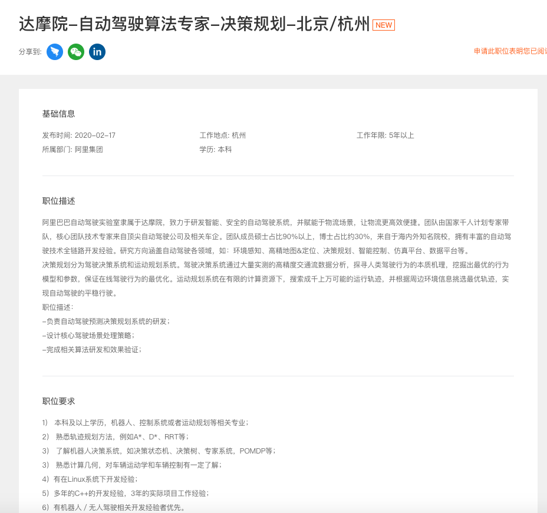

# 达摩院-自动驾驶算法专家-决策规划-北京/杭州 🙅已拒绝

# 达摩院-自动驾驶算法专家-感知-杭州 

岗位描述：

阿里巴巴自动驾驶实验室隶属于达摩院，致力于研发智能、安全的自动驾驶系统，并赋能于物流场景，让物流更高效便捷。团队由国家千人计划专家带队，核心团队技术专家来自顶尖自动驾驶公司及相关车企。团队成员硕士占比90%以上，博士占比约30%，来自于海内外知名院校，拥有丰富的自动驾驶技术全链路开发经验。研究方向涵盖自动驾驶各领域，如：环境感知、高精地图&定位、决策规划、智能控制、仿真平台、数据平台等。
 
 \1. 负责计算机视觉或深度学习算法相关的前沿技术研发工作;
 \2. 负责图像或三维点云中的目标检测、跟踪，图像理解等相关算法研发工作;
 \3. 负责SLAM、VIO等相关算法的研发工作;
 \4. 负责camera、lidar、radar等多传感器融合算法研发工作。

岗位要求：

\1. 熟练掌握深度学习技术，在图像视频全景分割、目标检测、语义分析等方面研发经验丰富，有多传感器（相机、激光雷达）融合感知项目经验最佳；
 \2. 计算机视觉、机器学习相关专业硕（博）士，有无人驾驶视觉感知系统研发经验者优先；
 \3. 具有扎实的工程实现能力和一定的数学功底，熟练使用常见的机器学习框架（pytorch、tensorflow等），计算机编程功底扎实，熟练使用C/C++；
 \4. 对新技术有持续热情，善于快速学习，个性乐观，善于与人沟通合作。

-有过SLAM算法经验；

-熟悉图像分割、目标检测及跟踪等计算机视觉相关算法；

-熟悉PID控制算法；

-熟悉某种深度学校框架，如TensorFlow, MXNet, Caffe, Torch等，对深度学习有深入的了解。

| 发布时间： | 2020-02-17 | 工作地点： | 杭州 | 工作年限： | 五年以上 |
| ---------- | ---------- | ---------- | ---- | ---------- | -------- |
| 所属部门： | 阿里集团   | 学  历：   | 本科 | 招聘人数： | 若干     |

岗位描述：

阿里巴巴自动驾驶实验室隶属于达摩院，致力于研发智能、安全的自动驾驶系统，并赋能于物流场景，让物流更高效便捷。团队由国家千人计划专家带队，核心团队技术专家来自顶尖自动驾驶公司及相关车企。团队成员硕士占比90%以上，博士占比约30%，来自于海内外知名院校，拥有丰富的自动驾驶技术全链路开发经验。研究方向涵盖自动驾驶各领域，如：环境感知、高精地图&定位、决策规划、智能控制、仿真平台、数据平台等。
 
 决策规划分为驾驶决策系统和运动规划系统。驾驶决策系统通过大量实测的高精度交通流数据分析，探寻人类驾驶行为的本质机理，挖掘出最优的行为模型和参数，保证在线驾驶行为的最优化。运动规划系统在有限的计算资源下，搜索成千上万可能的运行轨迹，并根据周边环境信息挑选最优轨迹，实现自动驾驶的平稳行驶。
 
 职位描述：
 -负责自动驾驶预测决策规划系统的研发；
 -设计核心驾驶场景处理策略；
 -完成相关算法研发和效果验证；

岗位要求：

1） 本科及以上学历，机器人、控制系统或者运动规划等相关专业；
 2） 熟悉轨迹规划方法，例如A*、D*、RRT等；
 3） 了解机器人决策系统，如决策状态机、决策树、专家系统，POMDP等；
 3） 熟悉计算几何，对车辆运动学和车辆控制有一定了解；
 4）有在Linux系统下开发经验；
 5）多年的C++的开发经验，3年的实际项目工作经验；
 6）有机器人／无人驾驶相关开发经验者优先。

