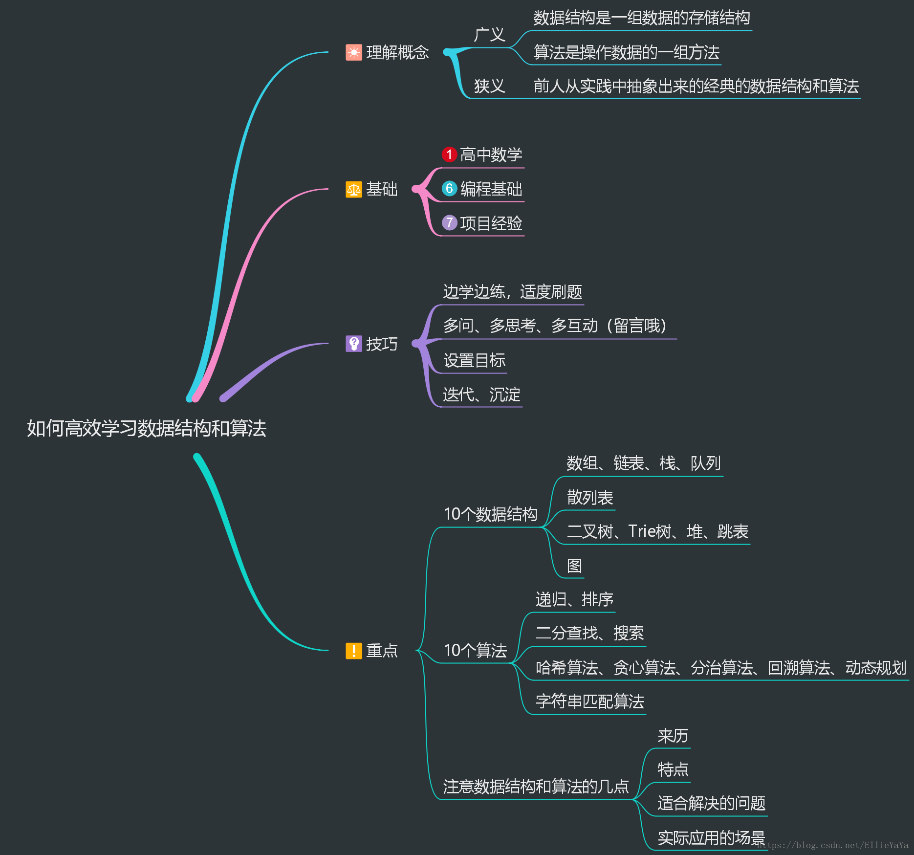
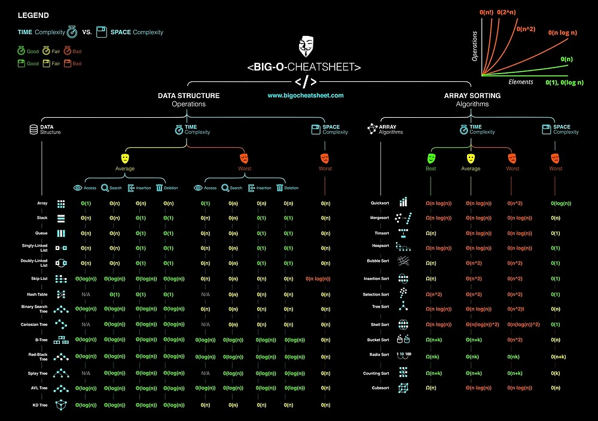
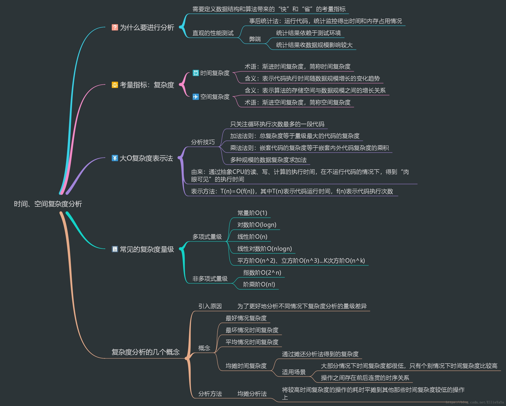

# 数据结构与算法之美

1. 如何抓住重点，系统高效地学习数据结构和算法
2. 复杂度分析
3. 数组和链表
4. 栈
5. 队列
6. 递归
7. 排序
8. 二分查找
9. 散列表
10. 哈希算法
11. 树
12. 堆
13. tbc
14. 

## 如何抓住重点，系统高效地学习数据结构和算法

 

涉及知识点简略图：

大体来说，数据结构部分就是线性表、散列表、树、图。算法部分基础是复杂度分析、基本算法思路，涉及到的算法有排序、搜索、查找、字符串匹配。 

 

有10个数据结构：数组、链表、栈、队列、散列表、⼆叉树、堆、跳表、图、Trie树； 

10个算法：递归、排序、⼆分查找、搜索、哈希算法、贪⼼算法、分治算法、回溯算法、动态规划、字符串匹配算法。 

 

## 复杂度分析

 

