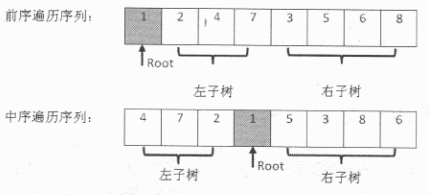
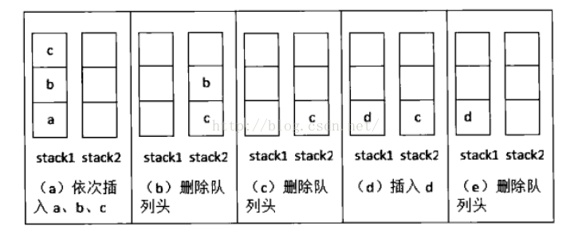
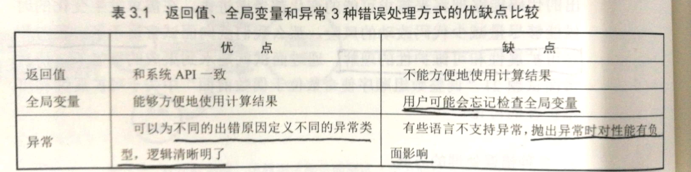
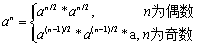
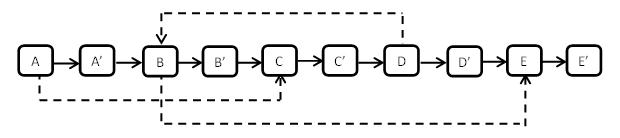

## 第一章面试的流程

**技术面试环节主要看重应聘者的5种素质：**

**1、扎实的理论基础**

编程语言：至少掌握两类编程语言：C++, Python

数据结构：链表、树、栈、队列和哈希表

算法：查找、排序、动态规划和贪婪算法，重点掌握二分查找、归并排序和快速排序

**2、高质量的代码**

重点考虑边界条件、特殊输入，写出鲁棒、稳定的大型软件

好习惯：在动手写代码前想好测试样例，写代码对异常情况会有所针对。

**3、清晰的思路**

复杂问题时，面试官不喜欢应聘者在没有形成清晰思路之前就草率地开始写代码，这样的代码容易逻辑混乱、错误百出。

可以尝试画图、举例和分解问题（递归）等方法帮助我们解决问题。

**4、优化效率的能力**

**5、优秀的综合能力**

沟通能力和学习能力，分析问题时思路清晰、能优化时间效率和空间效率、学习沟通能力。

## 第二章 面试需要的基础知识

**语言面试通常有3种类型：**

1、 面试官直接询问应聘者对C++概念的理解；

​    喜欢考察对C++关键字的理解程度

2、面试官拿出事先准备好的代码，让应聘者分析代码的运行结果；

​    C++的标准不允许复制构造函数传值参数（ A（A other）,赋值构造函数 ），否则会无限递归导致栈溢出；解决方法是把传值参数改成常量引用，即 A(const A& other)。

3、要求应聘者写代码定义一个类型或者实现类型中的成员函数

​    重点考察构造函数、析构函数及运算符重载。

推荐阅读的 C++ 书籍:

《Effective C++》 面试前突击C++

《C++ Primer》 C++语法全面的了解

《深度探索C++对象模型》 深入了解C++对象的内部

《The C++ Programming Language》 全面深入掌握C++的必选

**面试题1：赋值运算符函数**

CMyString& CMyString::operator=(const CMyString &str)

// 返回值类型为该类型的引用，并在函数结束时返回实例自身的引用（*this）;

// 传入的参数的类型声明为常量引用，否则传入的参数是实例，那么从形参到实参会调用一次复制构造函数，消耗资源

{

​    if(this==&str)  //判断是否指向同一个实例，自己给自己赋值

​        return *this;

​    

​    delete[] m_pData;  //释放实例自身的内存，防止内存泄漏

​    m_pData=nullptr;  

​    

​    // 异常安全性未考虑：分配内存时内存不足导致new char抛出异常，高级程序员需要注意

​    m_pData=new char[strlen(str.m_pData)+1];

​    strcpy(m_pData,str.m_pData);  //赋值传值

​    

​    return *this;  //返回实例自身的引用

}

​    面试官容易考察自己对C++和C#语言的区别理解，考察是否真的理解编程语言。

《Professional C#》 在附录有专门写给已有其它语言基础的程序员，详细分析了C#和其它编程语言的区别。C#语言不是魔鬼，自己要抱着学习的态度去熟悉和了解，后期不能排斥和不用,毕竟自己有一年多的C#编程实践。

**2.3 数据结构**

​    数组和字符串：它们用连续内存分别存储数字和字符。

​    链表和树：操作大量的指针，需要特别留意代码的鲁棒性，否则程序容易奔溃。

​    栈是一个与递归紧密相关的数据结构，队列与广度优先遍历算法紧密相关。

​    **数组**：它占用一块连续的内存并按照顺序存储数据。数组的空间效率不是很好，但是可以根据下标在O(1)时间读写任何元素，时间效率是最高的。

​    用数组来实现简单的哈希表，下标做哈希表的键值，数组中的数字设为哈希表的值，从而可以在O(1)时间内快速实现查找。

​    C++的STL的vector: 扩容操作要熟悉（P38）,每一次数组扩容都有大量的额外操作，因此使用动态数组要尽量减少改变数组容量大小的次数。

​    C++中，在32位系统上，对任意指针求sizeof得到的结构都是4；当数组作为函数的参数进行传递时，数组就自动退化为同类型的指针。

​    **字符串**：字符串是由若干字符组成的序列。

​    由于字符串在编程时使用的频率非常高，所以对字符串做了特殊的规定。

​    为了节省内存，C/C++把常量字符串放到单独的一个内存区域。当几个指针赋值给相同的常量字符串（如"hello world"）时，它们实际上会指向相同的内存地址；但用常量内存初始化数组，情况却不同，系统会给数组分配空间，并把常量字符串复制到数组中，从而初始地址和常量内存地址不同。

​    在C#中，String的内容是不能改变的，一旦试图改变String的内容，就会产生一个新的实例。

​    **链表**：链表是一种动态数据结构。当插入一个节点时，需要为新节点分配内存，然后调整指针的指向来确保新节点被链接到链表当中。

​    线性链表或单链表：整个链表的存取必须从头指针开始进行，头指针指示链表的第一个节点的存储位置；同理，最后一个节点的指针为nullptr。

​    单向链表节点定义：

​    struct ListNode

​    {

​        int   m_nValue;

​        ListNode* m_pNext;

​    };

​    ListNode* pNew=new ListNode();  // 返回指针

​    节点保存到栈中：std::stack<ListNode* > nodes;

​    nodes.push(pNode);  // 压栈

​    pNode=nodes.top();  // 获得栈顶元素

​    nodes.pop();  // 出栈

​    注意：在添加、删除节点时，需要传递pHead头指针的指针，即ListNode** pHead(解指针：*pHead)。因为往一个空链表插入一个节点时，新插入的节点就是链表的头指针，此时会改变头指针，因此必须把pHead参数设为指向指针的指针。

​    

​    **树**：

​    在二叉树中最重要的操作莫过于遍历，即按照某一顺序访问树中的所有节点。二叉树的前序遍历、中序遍历、后序遍历都有递归和循环两种不同的实现方法。每种遍历的递归实现都比循环实现要简洁很多。(必须掌握)

​    二叉搜索树（二叉树的特例）：左子节点总是小于或等于根节点，而右子节点总是大于或等于根节点。我们可以在O(logn)的时间内根据数值在二叉搜索树中找到一个节点。

​    二叉树的另外两个特例是堆和红黑树：堆分为最大堆和最小堆；红黑树是把树中的节点定义为红、黑两种颜色，并通过规则确保从根节点到叶子节点的最长路径的长度不超过最短路径的两倍。在C++中，set、multiset、map、multimap等数据结构都是基于红黑树实现的。

​    

​    **栈和队列**：

​    栈的特点是后进先出，是一个不考虑排序的数据结构，我们需要O(n)时间才能找到栈中最大或者最小的元素。

​    栈的应用：操作系统会给每个线程创建一个栈用来存储函数调用时各个函数的参数、返回地址及临时变量等。

​    队列的特点是先进先出。

​    

**面试题3：数组中重复的数字**

​    （一）：找出数组中重复的数字

​    题目：在一个长度为n的数组里的所有数字都在0到n-1的范围内。数组中某些数字是重复的，但不知道有几个数字重复了，也不知道每个数字重复了几次。请找出数组中任意一个重复的数字。例如，如果输入长度为7的数组{2, 3, 1, 0, 2, 5, 3}，那么对应的输出是重复的数字2或者3。

​    

​    方法一：数组排序，再从头到尾扫描排序后的数组  时间代价：O(nlogn)+O(n)，修改了数组。

​    方法二：哈希表 	时间代价：O(n)，空间代价：O(n)

​    方法三：我们重排这个数组，依然从头到尾扫描这个数组中的每个数字。当扫描到下标为 i 的数字时，首先比较这个数字（用 m 表示）是不是等于 i。如果是，接着扫描下一个数字；如果不是，再拿它和第 m 个数字进行比较。 如果它和第m个数字相等，就找到了一个重复的数字（该数字在下标为 i 和 m 的位置都出现了）；如果它和第 m 个数字不相等，就把第 i 个数字和第 m 个数字交换，把 m 放到属于它的位置。

​    接下来再重复这个比较、交换的过程，直到我们发现一个重复的数字。

​    每个数字最多只要交换两次就能够找到属于它的位置，因此总得时间复杂度是O(n)。时间代价：O(n)，空间代价：O(1)，修改了数组。

​    （二）：不修改数组找出重复的数字

​    题目：在一个长度为n+1的数组里的所有数字都在1到n的范围内，所以数组中至少有一个数字是重复的。请找出数组中任意一个重复的数字，但不能修改输入的数组。例如，如果输入长度为8的数组{2, 3, 5, 4, 3, 2, 6, 7}，那么对应的输出是重复的数字2或者3。

​    

​    方法一：使用O(n)的辅助空间，逐一把原数组的每一个数组复制到辅助数组，如果原数组中被复制的数组是m，则把它复制到辅助数组中下标为m的位置，很容易发现哪一个数字是重复的。时间代价：O(n)，空间代价：O(n)

​    方法二：我们把从1~n的数字从中间的数字m分为两部分，前面一半为1~m，后面一半为m+1~n。如果1~m的数字的数目大于m，那么这一半的区间一定包含重复的数字；否则，另一半m+1~n的区间里一定包含重复的数字。我们可以继续把包含重复的数字的区间一分为二，直到找到一个重复的数字。这个过程和二分查找算法很类似。

​    时间代价：O(nlogn),调用O(logn)次，每次需要O(n)的时间；空间代价：O(1),以时间换空间。这种算法不能保证找出所有重复的数字，即如果1~m的数字的数目等于m，则不能直接判断这一半区间是否包含重复的数字。

​    while(end>>start)

​    {

​        int middle=((end-start)>>1)+start;  //求中间值

​    }

​    面试官提出不同的功能要求或者性能要求（时间效率优先、空间效率优先），那么我们最终选取的算法也将不同，这也说明了和面试官交流的重要性，我们一定要在动手写代码之前弄清楚面试官的需求。

**面试题4：二维数组中的查找**

​    

​    题目：在一个二维数组中，每一行都按照从左到右递增的顺序排序，每一列都按照从上到下递增的顺序排序。请完成一个函数，输入这样的一个二维数组和一个整数，判断数组中是否含有该整数。

​    

​    举例找规律：首先选取数组中右上角的数字。如果该数字等于要查找的数字，则查找过程结束；如果该数字大于要查找的数字，剔除这个数字所在列；如果该数字小于要查找的数字，剔除这个数字所在的行。即，如果要查找的数字不在数组的右上角，则每一次都在数组的查找范围中删除一行或者一列，这样每一步都可以缩小查找的范围，直到找到要查找的数组，或者查找范围为空。

​    我们每次都选取数组查找范围右上角数字，同理，也可以选取左下角的数字。但是不可以选择左上角和右下角的数字。

​    

​    二维数组在内存中占据连续的空间。在内存中从上到下存储各行元素，在同一行中按从左到右的顺序存储。我们可以根据行号和列号计算出相对于数组首地址的偏移量，从而找到对应的元素。

​    int matrix[][4] = { { 1, 2, 8, 9 },{ 2, 4, 9, 12 },{ 4, 7, 10, 13 },{ 6, 8, 11, 15 } };

​    (int*) matrix;

​    int tempData = matrix[row*columns + column];  // 获取二维数组的数字

**面试题5：替换空格 （引申为合并两个数组，从后往前复制）**

​    题目：请实现一个函数，把字符串中的每个空格替换成"%20"。例如输入“We are happy.”，则输出“We%20are%20happy.”。

​    

​    应用背景：在网络编程中，如果URL参数含有特殊字符，比如空格、'#'等，则可能导致服务端无法获得正确的参数值，我们需要将这些特殊符号转换成服务器可以识别的字符，转换的规则是在‘%’后面跟上ASCII码的两位十六进制的表示，如空格的ASCII码是32，即0x20,因此空格被替换成"%20"。

​    

​    方法一：在原数组基础上进行替换，可能覆盖修改字符串。

​    方法二：新建新的字符串并在新的字符串上进行替换，需要分配足够多的内存。

​    

​    现假设面试官要求在原来的字符串上进行替换，并且保证输入的字符串后面足够多的空余内存。

​    方法一中的两个策略：

​    策略一：从前向后移动，每遇到一个空格，替换成"%20"，后面的字符移动两个位置，时间效率为O(n^2);

​    策略二：从后向前移动，先遍历一次字符串，统计空格的总数，从而计算替换之后的字符串的总长度；从字符串的后面开始复制和替换，指针P1指向原始字符串的末尾，P2指向替换之后的字符串的末尾；P1向前移动，逐个把它指向的字符复制到P2指向的位置，遇到空格P1移动1位，P2之前插入字符串"%20"，P2移动3位；直到P1和P2指向同一位置，表明所有空格已经替换完毕。时间效率为O(n);

​    

​    在面试中，可以画一两个示意图解释自己的思路，既可以理清思路，也可以和面试官交流变得高效。在面试官肯定我们的思路后，就可以开始写代码。

​    在面试中，如果我们打算修改输入的数据，则最好先问面试官是不是允许修改。

**面试题6：从尾到头打印链表 （栈或者递归）**

​    

​    题目：输入一个链表的头结点，从尾到头反过来打印出每个结点的值。

​    较简单，使用栈或递归实现。

​    

​    递归在本质上是一个栈结构，如果调用的层次很深，可能导致函数调用栈溢出。所以，用栈基于循环实现的代码比递归实现的代码的鲁棒性要好一些。

**面试题7：重建二叉树 （有难度，牛客网已****动手实现****）**

​    

​    题目：输入某二叉树的前序遍历和中序遍历的结果，请重建出该二叉树。假设输入的前序遍历和中序遍历的结果中都不含重复的数字。例如输入前序遍历序列{1,2, 4, 7, 3, 5, 6, 8}和中序遍历序列{4, 7, 2, 1, 5, 3, 8, 6}，则重建出图2.6所示的二叉树并输出它的头结点。

​    

​    在二叉树的前序遍历序列中，第一个数字总是树的根结点的值。但在中序遍历序列中，根结点的值在序列的中间，左子树的结点的值位于根结点的值的左边，而右子树的结点的值位于根结点的值的右边。因此我们需要扫描中序遍历序列，才能找到根结点的值。

​    如下图所示，前序遍历序列的第一个数字1就是根结点的值。扫描中序遍历序列，就能确定根结点的值的位置。根据中序遍历特点，在根结点的值1前面的3个数字都是左子树结点的值，位于1后面的数字都是右子树结点的值。

​    同样，在前序遍历的序列中，根结点后面的3个数字就是3个左子树结点的值，再后面的所有数字都是右子树结点的值。这样我们就在前序遍历和中序遍历两个序列中，分别找到了左右子树对应的子序列。

​    既然我们已经分别找到了左、右子树的前序遍历序列和中序遍历序列，我们可以用同样的方法分别去构建左右子树。也就是说，接下来的事情可以用递归的方法去完成。

​    在分析复杂问题时，如果大问题划分为若干小问题，且小问题和大问题在本质上是一致的，则可以考虑使用递归的方式去解决。

**面试题8：二叉树的下一个结点  （动手实现，逻辑情形分析比较有难度）**

​    

​    题目：给定一棵二叉树和其中的一个结点，如何找出中序遍历顺序的下一个结点？树中的结点除了有两个分别指向左右子结点的指针以外，还有一个指向父结点的指针。

​    

​    思路分析：复杂问题需要画出二叉树的结构图，通过具体的例子找出中序遍历下一个节点的规律。

​    1、该结点有右孩子，则中序遍历下一个结点就是该结点右子树中的最左子结点；

​    2、该结点无右孩子，且该结点是其父结点的左孩子，则中序遍历的下一个结点就是其父结点；

​    3、该结点无右孩子，且该结点是其父结点的右子结点，我们可以沿着指向父结点的指针一直向上遍历，直到找到一个是它父结点的左子结点的结点（判断父节点是否存在，以防该节点为根节点）。如果这样的结点存在，那么这个结点的父结点就是我们要找的中序遍历下一个结点。如果不存在，则没有下一个节点。

**面试题9：用两个栈实现队列**

​    

​    题目：用两个栈实现一个队列。队列的声明如下，请实现它的两个函数appendTail和deleteHead，分别完成在队列尾部插入结点和在队列头部删除结点的功能。

​    

​    思路：如上图所示，举例发现规律如下。stack1负责压入，stack2负责弹出。

​    删除元素：当stack2不为空时，在stack2中的栈顶元素是最先进入队列的元素，可以弹出。当stack2为空时，我们把stack1中的元素逐个弹出并压入stack2。由于先进入队列的元素被压倒stack1的底端，经过弹出和压入操作之后就处于stack2的顶端，又可以直接弹出。

​    插入元素：直接压入stack1中。

​    扩展：用两个队列实现一个栈。

​    http://www.cnblogs.com/DHUtoBUAA/p/7389076.html （我的博客）

**2.4 算法和数据操作**

​    很多算法都可以用递归和循环两种不同的方式实现。通常基于递归的实现方法代码会比较简介，但性能不如基于循环的实现方法。

​    排序和查找是面试时考察的重点，尤其应该重点掌握二分查找、归并排序和快速排序，做到随时能正确、完整地写出它们的代码。

​    在二维数组（可能具体表现为迷宫或棋盘）上搜索路径，我们可以尝试回溯法，回溯法很适合用递归的代码实现。如果限定不能使用递归实现，我们可以考虑使用栈来模拟递归的过程。

​    如果面试题是求某个问题的最优解，并且该问题可以分为多个子问题，那么我们可以尝试用动态规划。在用自上而下的递归思想去分析动态规划时会发现子问题之间重叠更小的子问题，所以推荐使用自下而上的循环代码实现，用基于子问题的解计算大问题的解。

​    在动态规划的思路中，如果分解子问题的时候存在某个特殊的选择，这个特殊的选择将一定能够得到最优解，那么可以考虑使用贪婪算法解决。当然，需要数学证明贪婪选择的确最后能够得到最优解。

​    **递归和循环**：

​    递归是在一个函数的内部调用这个函数自身。

​    递归函数命名： _Recursive

​    循环函数命名： _Iterative

​    递归的缺点：递归由于是函数调用自身，而函数调用是有时间和空间的消耗的，如每一次函数调用在内存栈中分配空间，往栈里压入和弹出数据需要时间，所以递归实现的效率不如循环。递归中很多计算是重复的，从而给性能带来很多负面的影响。除效率之外，递归还可能引起更严重的问题：调用栈溢出。

​    但是，递归的实现要比循环简单，如果面试官没有特殊要求，则应聘者可以尽量多采用递归的方法编程，代码简介，更容易实现。

​    在斐波那契数列中，用递归方法计算的时间复杂度是以n的指数方式递增的。

​    **查找和排序**：

​    查找相对简单，不外乎顺序查找、二分查找、哈希表查找和二叉排序树查找。

​    如果面试题目要求在排序的数组中查找一个数字或者统计某个数字出现的次数，那么我们可以尝试用二分查找算法。

​    哈希表最主要的特点是能够在O(1)时间内查找某一元素，是效率最高的查找方式，其缺点是需要额外的空间来实现哈希表。

​    排序比查找要复杂一些。面试官会要求应聘者比较插入排序、冒泡排序、归并排序、快速排序等不同算法的优劣。快排和归并程序实现烂熟于心。建议重点研读P80-P81,面试撞题概率大。

​    特例：年龄排序，用常数的辅助空间换来O(n)的时间效率。	 

​    快排--代码段.note

​    快排实现代码，烂熟于心

​    归并排序递归和循环版本.note

​    归并排序的递归和循环代码，烂熟于心

​    **回溯法**：

​    回溯法从解决问题每一步的所有可能选项里系统地选择出一个可行的解决方案。回溯法非常适合由多个步骤组成的问题，并且每个步骤都有多个选项。

​    用回溯法解决的问题的所有选项可以形象地用树状结构表示。

​    通常回溯法算法适合用递归实现代码。当我们到达某一个节点时，尝试所有可能的选项并在满足条件的前提下递归地抵达下一个节点。

​    

​    **动态规划和贪婪算法**：

​    如果面试题是求一个问题的最优解（通常是求最大值或者最小值），而且该问题能够分解成若干个子问题，并且子问题之间还有重叠的更小的问题，就可以考虑用动态规划来解决这个问题。

​    我们在应用动态规划之前要分析能否把大问题分解成小问题，分解后的每个小问题也存在最优解。如果把小问题的最优解组合起来能够得到整个问题的最优解，那么我们可以应用动态规划解决这个问题。

​    由于子问题在分解大问题的过程中重复出现，为了避免重复求解子问题，我们可以用从下往上的顺序先计算小问题的最优解并存储下来，再以此为基础求取大问题的最优解。从上往下分析问题，从下往上求解问题。

​    当我们应用贪婪算法解决问题的时候，每一步都可以做出一个贪婪的选择，基于这个选择，我们确定能够得到最优解。为什么这样的贪婪算法能够得到最优解？这是我们使用贪婪算法时都需要问的问题，需要用数学方式来证明贪婪选择是正确的。

​    

​    **位运算**：

​    位运算是把数字用二进制表示之后，对每一位上0或者1的运算。

​    位运算总共有五种：与、或、异或、左移和右移。

​    左移运算符m<<n表示把m左移n位。在左移n位的时候，最左边的n位将被丢弃，同时最右边补上n个0。

​    右移运算符m>>n表示把m右移n位。在右移n位的时候，最右边n位将被丢弃。如果数字是一个无符号数值，则用0填补最左边的n位；如果数字是一个有符号数值，则用数字的符号位填补最左边的n位。

​    00001010>>2=00000010

​    10001010>>3=11110001

**面试题10：斐波那契数列**

​    

​    题目：写一个函数，输入n，求斐波那契（Fibonacci）数列的第n项。

​    方法一：递归，时间复杂度以n的指数方式递增；

​    方法二：循环，时间复杂度是O(n);

​    方法三：数学公式，通过矩阵[f(n) f(n-1); f(n-1) f(n-2)]=[1 1; 1 0]的n-1次方来得到f(n)，其时间复杂度是O(logn),涉及到基于递归用O(logn)的时间求得n次方的算法值得学习。

​    

​    题目扩展：青蛙跳台阶，小矩形覆盖大矩形

**面试题11：旋转数组的最小数字**

​    

​    题目：把一个数组最开始的若干个元素搬到数组的末尾，我们称之为数组的旋转。输入一个递增排序的数组的一个旋转，输出旋转数组的最小元素。例如数组{3, 4, 5, 1, 2}为{1, 2, 3, 4, 5}的一个旋转，该数组的最小值为1。

​    如果面试题目要求在排序的数组中查找一个数字或者统计某个数字出现的次数，那么我们可以尝试用二分查找算法。

​    

​    思路分析：旋转的数组中，前面子数组的元素都大于或者等于后面子数组的元素。

​    我们试着用二元查找法的思路在寻找这个最小的元素。

​    首先我们用两个指针，分别指向数组的第一个元素和最后一个元素。按照题目旋转的规则，第一个元素应该是大于或者等于最后一个元素的（这其实不完全对，还有特例）。

​    接着我们得到处在数组中间的元素。如果该中间元素位于前面的递增子数组，那么它应该大于或者等于第一个指针指向的元素。此时数组中最小的元素应该位于该中间元素的后面。我们可以把第一指针指向该中间元素，这样可以缩小寻找的范围。

​    同样，如果中间元素位于后面的递增子数组，那么它应该小于或者等于第二个指针指向的元素。此时该数组中最小的元素应该位于该中间元素的前面。我们可以把第二个指针指向该中间元素，这样同样可以缩小寻找的范围。

​    我们接着再用更新之后的两个指针，去得到和比较新的中间元素，循环下去。

​    按照上述的思路，我们的第一个指针总是指向前面递增数组的元素，而第二个指针总是指向后面递增数组的元素。最后第一个指针将指向前面子数组的最后一个元素，而第二个指针会指向后面子数组的第一个元素，也就是它们最终会指向两个相邻的元素，而第二个指针指向的刚好是最小的元素，这就是循环结束的条件。

​    特例：

​    1、当arr[start]=arr[middle]=arr[end],即中间元素无法确认是前一个子数组还是后一个子数组，无法移动两个指针来缩小查找的范围，那么我们不得不采用顺序查找的方法。

​    2、排序数组本身是数组旋转的一个特例，注意思维的全面性。

**面试题12：矩阵中的路径 （牛客网编程已实现）**

​    

​    题目：请设计一个函数，用来判断在一个矩阵中是否存在一条包含某字符串所有字符的路径。路径可以从矩阵中任意一格开始，每一步可以在矩阵中向左、右、上、下移动一格。如果一条路径经过了矩阵的某一格，那么该路径不能再次进入该格子。例如在下面的3×4的矩阵中包含一条字符串“bfce”的路径（路径中的字母用下划线标出）。但矩阵中不包含字符串“abfb”的路径，因为字符串的第一个字符b占据了矩阵中的第一行第二个格子之后，路径不能再次进入这个格子。

​    // A B T G

​    // C F C S

​    // J D E H

​    通常在二维矩阵上找路径这类问题都可以应用回溯法解决。

​    首先，在矩阵中任选一个格子作为路径的起点。假设矩阵中某个格子的字符为ch并且这个格子对应于路径上的第i个字符。如果路径上第i个字符不是ch，那么这个格子就不可能处在路径上的第i个位置。如果路径上的第i个字符正好是ch，就往相邻的格子寻找路径上第i+1个字符。除了在矩阵边界上的格子之外，每个格子都有4个相邻的格子。重复这个过程直到路径上的所有字符都在矩阵中找到相应的位置。两重循环遍历每一个元素，作为路径的第一个元素。

​    当在矩阵中定位了路径上n个字符的位置后，在与第n个字符对应的格子周围都没有找到第n+1个字符，则只好在路径上回到第n-1个字符，重新去寻找第n个字符。

​    由于路径不能重复进入格子，我们需要定义一个字符矩阵一样大小的布尔值矩阵，用来标记路径是否已经进入了相应格子。

**面试题13：机器人的运动范围**

​    题目：地上有一个m行n列的方格。一个机器人从坐标(0, 0)的格子开始移动，它每一次可以向左、右、上、下移动一格，但不能进入行坐标和列坐标的数位之和大于k的格子。例如，当k为18时，机器人能够进入方格(35, 37)，因为3+5+3+7=18。但它不能进入方格(35, 38)，因为3+5+3+8=19。请问该机器人能够到达多少个格子？

​    

​    通常物体或者人在二维方格运动这类问题都可以用回溯法解决；我们一般把矩阵看成一个二维的数组。

​    

​    机器人从坐标（0,0）开始移动。当它准备进入坐标（i,j)的格子时，通过检查坐标的位数和来判断机器人是否已经遍历过来判断能否进入。如果能够进入坐标为（i,j)的格子，我们接着再判断它是否进入四个相邻的格子（i,j-1),(i-1,j),(i,j+1),(i+1,j)，因此我们可以用如下的代码来实现回溯法。从（0,0）点开始遍历，不需要循环遍历每个元素，然后让每一个元素尝试，类似于感染。

​    

**面试题14：剪绳子**

​    

​    题目：给你一根长度为n绳子，请把绳子剪成m段（m、n都是整数，n>1并且m>1）。每段的绳子的长度记为k[0]、k[1]、……、k[m]。k[0]*k[1]*…*k[m]可能的最大乘积是多少？例如当绳子的长度是8时，我们把它剪成长度分别为2、3、3的三段，此时得到最大的乘积18。

​    

​    方法一：动态规划 时间代价O(n^2)，空间代价O(n)

​    数学表达式：f(n)=max(f(i)*f(n-i)),0<i<n

​    方法二：贪婪算法 时间代价O(1)，空间代价O(1)

​    当n>=5时，我们尽可能多地剪长度为3的绳子；当剩下的绳子长度为4时，把绳子剪成两段长度为2的绳子。

​    

​    能够灵活运用动态规划解决问题的关键是具备从上到下分析问题、从下到上解决问题的能力，而灵活运用贪婪算法则需要扎实的数学基本功。

**面试题15：二进制中1的个数**

​    

​    题目：请实现一个函数，输入一个整数，输出该数二进制表示中1的个数。例如把9表示成二进制是1001，有2位是1。因此如果输入9，该函数输出2。

​    方法一：可能引起死循环的解法

​    先判断整数二进制表示中最右边一位是不是1；接着把输入的整数右移一位，此时原来处于从右边数起的第二位被移到最右边了，再判断是不是1。这样每次移动一位，直到整个整数变成0为止。

​    但是针对负数，则可能陷入死循环中，因为负数右移是用1补齐。

​    

​    方法二：常规解法

​    把n和1做与运算，判断n的最低位是不是为1。接着把1左移一位得到2，再和n做与运算，就能判断n的次低位是不是1。

​    

​    方法三：给面试官带来惊喜的解法

​    特点1：把一个整数减去1，都是把最右边的1变成0。如果它的右边还有0，则所有的0都是1，而它左边的所有位都保持不变。

​    特点2：把一个整数减去1，再和原整数做与运算，会把该整数最右边的1变成0。那么一个整数的二进制表示中有多少个1，就可以进行多少次这样的操作。

​    注意：负数0x80000000-1=0x7FFFFFF,变成正数最大值。

​    

​    举一反三：把一个整数减去1，再和原整数做与运算，会把该整数最右边的1变成0

​    用一条语句判断一个整数是不是2的整数次方；

​    if(n&(n-1)==0)

​    {

​        // 该数二进制表示中有且只有一位是1

​        return true; //	

​    }

​    输入两个整数m和n，计算需要改变m的二进制表示中的多少位才能得到n?

​    1、求两个数的异或；2、统计异或结果中1的位数。

​    把一个整数减去1之后，再和原来的整数做位与运算，得到的结果相当于把整数的二进制表示中最右边的1变成0。

## 第三章 高质量的代码

清晰的书写、清晰的布局（缩进）、合理的命名都决定着代码的规范性。

​    在手写代码时，减慢写字的速度，尽量把每个字母写清楚还是有必要的。

​    强烈建议应聘者在写代码的时候，用完整的英文单词组合命名变量和函数，以便自己和面试官能一眼读懂代码的意图。

​    

**3.3 代码的完整性**

​    

​    面试官通过检查代码是否完整来考察应聘者的思维是否全面。通常面试官会检查应聘者的代码是否完成了基本功能、输入边界值是否能够得到正确的输出、是否对各种不合规范的非法输入做出了合理的错误处理。

​    从三方面确保代码的完整性：1、在编码之前考虑单元测试，把各种可能的输入想清楚。通常我们可以从功能测试、边界测试和负面测试3个方面设计测试用例。

​    在软件开发过程中，永远不变的就是需求会一直改变。如果我们在面试的时候写出的代码能够把将来需求可能的变化都考虑进去，在需求变化的时候能够尽量减少代码改动的风险，那么我们向面试官展示了自己对程序可扩展性和可维护性的理解，通过面试就是水到渠成的事情。

​    三种错误处理的方法：1、函数用返回值来告知调用者是否出错；2、当错误发生时设置一个全局变量，此时可以在返回值中传递计算结果；3、异常，当函数运行出错的时候，我们就抛出异常。

​    异常在高级语言中是强烈推荐的错误处理方式。

**面试题16：数值的整数次方**

​    题目：实现函数double Power(double base, int exponent)，求base的exponent次方。不得使用库函数，同时不需要考虑大数问题。

​    要求实现特定库函数（特别是处理数值和字符串的函数）的功能是一类常见的面试题，这要求我们平时编程的时候除了能熟练使用库函数，最重要的是要理解库函数的实现原理。

​    

​    考虑全面：1、如果输入的指数小于1（零和负数）的时候怎么办？2、如果底数是零且指数是负数的时候，如果不特殊处理，会出现对0求倒数；3、0的0次方如何处理？

​    快速求取a的n次方：快速做乘方，时间效率是O(logn);

​    double PowerWithUnsignedExponent(double base, unsigned int exponent)

> {

> ​    if (exponent == 0)

> ​        return 1;

> ​    if (exponent == 1)

> ​        return base;

> 

> ​    // 位运算的效率比乘除法及求余运算的效率要高很多，把优化做到极致。

> ​    double result = PowerWithUnsignedExponent(base, exponent >> 1);  //右移运算符取代了除以2

> ​    result *= result;

> ​    if ((exponent & 0x1) == 1)  //位与运算符代替了求余运算符（%）来判断一个数是奇数还是偶数

> ​        result *= base;

> ​    return result;

> }

**面试题17：打印1到最大的n位数 （大数问题）**

​    题目：输入数字n，按顺序打印出从1最大的n位十进制数。比如输入3，则打印出1、2、3一直到最大的3位数即999。

​    

​    如果面试题是关于n位的整数并且没有限定n的取值范围，或者输入任意大小的整数，那么这道题目很有可能是需要考虑大数问题的。字符串是一种简单、有效地表示大数的方法。

​    

​    方法一：在字符串上模拟数字加法的解法，模拟整数的加法，代码略长

> // 字符串number表示一个数字，在 number上增加1

> // 如果做加法溢出，则返回true；否则为false

> bool Increment(char* number)

> {

> ​    bool isOverflow=false; //是否溢出

> ​    int isTakeover=0; //是否进位

> 

> ​    int nlength=strlen(number);

> ​    for(int i=nlength-1;i>=0;i--)

> ​    {

> ​        int nSum=number[i]-'0'+isTakeover;

> ​	if(i==nlength-1)  //个位数递增，数值变化从这里开始

> ​	    nSum++;

> ​	if(nSum>=10)

> ​	{

> ​	    if(i==0)

> ​	    {

> ​	        //最高位溢出

> ​                isOverflow=true;

> ​	    }

> ​	    nSum-=10;

> ​	    isTakeover=1;

> ​	    number[i]='0'+nSum;

> ​	}

> ​        else

> ​	{

> ​	    number[i]='0'+nSum;

> ​	    break;  //减少无效运算量

> ​	}

> ​    }

> ​    return isOverflow;

> }

​    方法二：把问题转换成数字排列的解法，递归让代码更简洁

​    思路：n位所有十进制数其实就是n个从0到9的全排列，我们把数字的每一位都从0到9排列一遍，就得到所有的十进制数。

​    全排列的递归表达：数字的每一位都可能是0~9中的一个数，然后设置下一位，递归结束的条件是我们已经设置了数字的最后一位。

> void Print1ToMaxOfNDigitsRecursively(char* number,int length,int index)

> {

> ​    if(index==length-1)

> ​    {

> ​        PrintNumber(number);   // 终止递归

> ​	return;

> ​    }

> ​    for(int i=0;i<10;i++)

> ​    {

> ​        // 全排列

> ​        number[index+1]='0'+i;

> ​	Print1ToMaxOfNDigitsRecursively(number,length,index+1); 

> ​    }

> }

**面试题18：删除链表的节点**

​    

​    （一）：在O(1)时间删除链表结点

​    题目：给定单向链表的头指针和一个结点指针，定义一个函数在O(1)时间删除该结点。

​    

​    思路：在单向链表中，节点中没有指向前一个节点的指针。

​    方法一：常规思路是顺序查找链表中的节点并删除，需要从头查找将被删除的节点的前一个节点，时间复杂度自然就是O(n);

​    方法二：如果我们把下一个节点的内容复制到需要删除的节点上覆盖原有的内容，再把下一个节点删除，那么相当于把之前需要删除的节点删除了。当时如果要删除的节点位于链表的尾部，那么就没有下一个节点，需要按方法一来做。此外，我们不能确保节点在链表中，需要O（n）的时间才可以判断要删除的节点是否在链表中。

​    如果链表中只有一个节点，而我们又要删除链表的头节点，那么删除之后需要把链表的头节点设置为nullptr。

​    （二）：删除链表中重复的结点

​    题目：在一个排序的链表中，如何删除重复的结点？例如，在图3.4（a）中重复结点被删除之后，链表如图3.4（b）所示。

​    

​    如果重复的节点位于链表的头部，那么链表的头节点也可能被删除，所以删除函数应该被声明为void deleteDuplication(ListNode** pHead),而不是void deleteDuplication(ListNode* pHead)。

​    思路：从头遍历链表，如果当前节点（pNode）的值与下一个节点的值相同，那么它们是重复的节点可以被删除；为了保证删除之后的链表仍然是相连的，我们要把当前节点的前一个节点（pPreNode）和后面值与当前节点的值不同的节点相连，从而确保pPreNode始终与下一个没有重复的节点连接在一起。

​    // while 遍历循环

​    while (pToBeDel!=nullptr && pToBeDel->m_nValue==value)

​    {

​        pNext = pToBeDel->m_pNext;  //要删除的下一个元素

​        delete pToBeDel;  //删除pToBeDel

​        pToBeDel = nullptr;

​        pToBeDel = pNext;

​	}

**面试题19：正则表达式匹配 	(递归实现)**

​    

​    题目：请实现一个函数用来匹配包含'.'和'*'的正则表达式。模式中的字符'.'表示任意一个字符，而'*'表示它前面的字符可以出现任意次（含0次）。在本题中，匹配是指字符串的所有字符匹配整个模式。例如，字符串"aaa"与模式"a.a"和"ab*ac*a"匹配，但与"aa.a"及"ab*a"均不匹配。--非确定有限状态机

​    

​    思路：分情况讨论问题

​    要充分考虑普通字符、'.'和'*'三者的排列组合，尽量完备地想出所有可能的测试用例。

​    '.'情况：如果字符串中的第一个字符和模式中的第一个字符串相匹配，那么在字符串和模式上都向后移动一个字符，然后匹配剩下的字符串和模式。

​    '*'情况（复杂）：

​    1、出现次数为0，模式向后移动2个字符，这相当于'*'和它前面的字符被忽略了，因为'*'可以匹配字符串中的0个字符；

​    2、模式中的第一个字符和字符串中的第一个字符相匹配，则字符串向后移动一个字符

​    a)模式向后移动两个字符串，出现次数为1

​    b)模式保持不变，出现次数多余1

​    

​    注意：可能出现.*的情形，所以比较是否相等的表达式为

​    if(*(pattern+1)=='*')

​    {

​        if(*pattern==*str || (*pattern==',' && *str!='\0'))

**面试题20：表示数值的字符串**

​    

​    题目：请实现一个函数用来判断字符串是否表示数值（包括整数和小数）。例如，字符串“+100”、“5e2”、“-123”、“3.1416”及“-1E-16”都表示数值，但“12e”、“1a3.14”、“1.2.3”、“+-5”及“12e+5.4”都不是。

​    

​    思路：表示数值的字符串遵循模式A[.[B]][e|EC]或者.B[e|EC]。上述A和C都可能是以'+'或'-'开头的0~9的字符串。

​    判断一个字符串是否符合上述模式时，尽可能多地扫描0~9的数位，也就是前面模式中的表示数值整数的A部分；如果遇到小数点'，'，则开始扫描表示数值小数部分的B部分。如果遇到'e'或'E',则开始扫描表示数值指数的C部分。

​    在应聘者写完代码后，面试官会期待应聘者能够完备地测试用例来验证自己的代码。

​    

// 用来扫描字符串中的0~9的数位，可以用来匹配前面数值模式中的B部分。

bool scanUnsignedInteger(const char** str)  //str指针的指针，可以修改字符串的起始地址

{

​	const char* before = *str;

​	while (**str!='\0' && **str>='0'  && **str<='9')

​	{

​		++(*str);

​	}

​	return *str > before;	// 指针比较，如果str修改过则返回true

}

**面试题21：调整数组顺序使奇数位于偶数前面**

​    

​    题目：输入一个整数数组，实现一个函数来调整该数组中数字的顺序，使得所有奇数位于数组的前半部分，所有偶数位于数组的后半部分。

​    

​    **只完成基本功能的解法，仅适用于初级程序员**

​    维护两个指针:第一个指针初始化时指向数组的第一个数字，它只向后移动；第二个指针初始化时指向数组的最后一个数字，它只向前移动。在两个指针相遇之前，第一个指针总是位于第二个指针的前面。如果第一个指针指向的是偶数，并且第二个指针指向的数字是奇数，则交换这两个数字。

​    即

​    如果不考虑奇数和奇数，偶数和偶数之间的相对位置不变。那么只需要两个指针分别指向数组的头和尾，依次比较。

​    \1. 如果头指针指向的数组位置为奇数，那么就判断尾指针指向的数组位置的奇偶性。如果是奇数，则头指针后移一个位置，如果是偶数，则尾指针前移一个位置。

​    \2. 如果头指针指向的数组位置为偶数，那么就判断尾指针指向的数组位置的奇偶性。如果是奇数，则交换头尾指针指向的数组元素，如果是偶数，则尾指针前移一个位置。

​    

​    **考虑可扩展的解法，能秒杀Offer**

​    有时候面试官期待我们提供的不仅仅是解决一个问题的办法，而是解决一系列同类型问题的通用办法。这就是面试官在考察我们对扩展性的理解，即希望我们能够给出一种模式，在这种模式下能够很方便地把已有的解决方案扩展到同类型的问题上去。

​    解耦的好处是提高了代码的重用性，为扩展功能提供了便利。

​    把判断的标准变成一个函数指针，用一个单独的函数来判断数字是不是符合标准。

​    void Reorder(int* pData, unsigned int length, bool(*func)(int))  // 函数指针，func指向一个函数，该函数参数是int,返回值是bool类型

​    

**3.4 代码的鲁棒性**

​    

​    鲁棒性（Robust）是指程序能够判断输入是否合乎规范要求，并对不符合要求的输入予以合理的处理。

​    容错性是鲁棒性的一个重要体现。提高代码的鲁棒性的有效途径是进行防御性编程，防御性编程是一种编程习惯，是指预见在什么地方可能会出现问题，并为这些可能出现的问题制定处理方式。

​    在面试时，最简单也最实用的防御性编程就是在函数入口添加代码以验证用户输入是否符合要求。比如输入的是指针，判断是否为nullptr;比如输入的是一个字符串，判断字符串的内容为空怎么办。

​    

 **面试题22：链表中倒数第k个结点 （简单的代码隐藏3个潜在的风险）**

​    

​    题目：输入一个链表，输出该链表中倒数第k个结点。为了符合大多数人的习惯，本题从1开始计数，即链表的尾结点是倒数第1个结点。例如一个链表有6个结点，从头结点开始它们的值依次是1、2、3、4、5、6。这个链表的倒数第3个结点是值为4的结点。

​    

​    方法一：遍历链表两次，第一次统计出链表中节点的个数，第二次找出倒数第k个节点（n-k+1）。

​    方法二：遍历链表一次，定义两个指针。第一个指针从链表的头指针开始遍历向前走k-1步，第二个指针保持不变；从第k步开始，第二个指针也开始从链表的头指针开始遍历。由于两个指针的距离保持在k-1,当第一个指针到达链表的尾节点时，第二个指针正好指向倒数第k个节点。

​    面试过程中写代码要特别注意鲁棒性。如果写出的代码存在多处奔溃的风险，那么我们很可能和Offer失之交臂。

​    程序奔溃可能原因：

​    ListNode* FindKthToTail(ListNode* pListHead, unsigned int k)

​    1、输入的pListHead为空指针。

​    2、输入的pListHead为头节点的链表的节点总数少于k。

​    3、输入的参数k为0.因为k是一个无符号整数（unsigned int），那么k-1将不是-1，而是4294967295（无符号的0xFFFFFFFF）。

​    

​    举一反三：当我们用一个指针遍历不能解决问题的时候，可以尝试用两个指针来遍历链表，可以让其中一个指针遍历的速度快一些（一次走两步），或者让它在链表上先走若干步。

**面试题23：链表中环的入口结点 （贼精的题目，难度和代码量均比较大，****牛客网刷题****）**

​    题目：一个链表中包含环，如何找出环的入口结点？例如，在图3.8的链表中，环的入口结点是结点3。

​    

​    思路：

​    考察应聘者分析问题的能力。把一个问题分解成几个简单的步骤，是一种常见的解决复杂问题的方法。为了解决这个问题，我们可以把它分解成3个步骤：找出环中任意一个节点；得到环中节点的数目；找到环的入口节点。

​    1、确认一个链表是否有环？

​    定义两个指针，同时从链表的头节点出发，一个指针一次走一步，一个指针一次走两步。如果走得快的指针追上走的慢的指针，那么链表含有环；如果走得快的指针走到了链表的末尾（m_pNext指向null）都没有追上第一个指针，那么链表就不包含环。

​    2、如何找到环的入口？

​    先定义两个指针P1和P2指向链表的头节点。如果链表中的环有n个节点，则指针P1先在链表上向前移动n步，然后两个指针以相同的速度向前移动。当第二个指针指向环的入口时，第一个指针已经围绕着环走了一圈，又回到了入口节点。

​    3、如何得到环中节点的数目？

​    在1中用到了一快一慢的两个指针，两个指针相遇的节点一定在环中，可以从这个节点出发，一边继续向前移动一边计数，当再次回到这个节点时，就可以得到环中节点数。

​    

**面试题24：反转链表**

​    

​    题目：定义一个函数，输入一个链表的头结点，反转该链表并输出反转后链表的头结点。

​    

​    通过指针操作来考察应聘者的编程功底。为了避免出错，我们最好先进行全面的分析。在实际软件开发周期中，设计的时间通常不会比编码的时间短。在面试的时候我们不要急于动手写代码，而是一开始仔细分析和设计，这将会给面试官留下很好的印象。与其很快写出一段漏洞百出的代码，倒不如仔细分析再写出鲁棒的代码。

​    应聘者如何及时发现并纠正代码中的问题，一个很好的办法是提前想好测试用例。在写出代码之后，立即用事先准备好的测试用例检查测试。

​    自己多花时间找出问题并修正问题，比在面试官找出问题之后再去慌忙地修改代码要好很多。    --我经常犯的错误，写好代码自己不检查，然后面试官指正再回炉修改。

​    

​    方法一：定义3个指针，分别指向当前遍历到的节点，它的上一个节点及后一个节点。while实现

​    方法二：用递归实现同样的反转链表的功能。

**面试题25：合并两个排序的链表**

​    题目：输入两个递增排序的链表，合并这两个链表并使新链表中的结点仍然是按照递增排序的。例如输入图3.11中的链表1和链表2，则合并之后的升序链表如链表3所示。

​    

​    递归做法：当我们得到两个链表中值较小的头节点并把它链接到已经合并的链表之后，两个链表剩余的节点仍然是排序的。

​    1、新建头节点，ListNode* pMergedHead=nullptr。

**面试题26：树的子结构 （****牛客网编程实践****）**

​    题目：输入两棵二叉树A和B，判断B是不是A的子结构。

​    

​    和链表相比，树中的指针操作更多也更复杂，因此与树相关的问题通常会比链表的更难。如果想要加大面试的难度，则树的题目是很多面试官的选择。面对大量的指针操作，我们要更加小心。

​    在计算机表示小数时都有误差，所以判断两个小数是否相等，只能判断它们之差的绝对值是不是在一个很小的范围内。如果两个小数的差很小，则认为它们相等。

​    思路：

​    第一步：在树A中找到和树B的根节点的值一样的节点R; --树的遍历，递归实现

​    第二步：判断树A中以R为根节点的子树是不是包含和树B一样的结构。  --递归思路，递归的终止条件是到达了树A或者树B的叶节点。

​    

​    应聘者需要采用防御性编程的方式，每次访问指针地址之前都需要考虑这个指针有没有可能是nullptr。

**3.5 本章小结**

​    

​    规范性：大多数面试都要求应聘者在白纸或者白板上写代码。应聘者在编码的时候要注意规范性，尽量清晰地写出每个字母，通过缩进或者对齐括号让代码布局合理，同时合理命名代码中的变量和函数。

​    完整性：最好在编码之前全面考虑所有可能的输入，确保写出的代码在完成了基本功能之外，还考虑了边界条件，并做好了错误处理。只有全面考虑到这3个方面的代码才是完整的代码。

​    鲁棒性：平时写代码的时候，应聘者应该养成防御性编码的习惯，在函数入口判断输入是否有效，并对各种无效输入做好相应的处理。

## 第四章 解决面试题的思路

**4.1 面试官谈面试思路**

​    编码前讲自己的思路是一个考察指标。应聘者可以采用举例子、画图等多种方式，解释清楚问题本身和问题解决方案是关键。

​    应聘者在写代码之前，先和面试官解释解题思路和设计，获得面试官的认可后再动手写代码。不要蒙头写代码。

​    

**4.2 画图让抽象问题形象化**

​    画图是在面试过程中应聘者用来帮助自己分析、推理的常用手段。图像能使抽象的问题具体化、形象化，可能通过画图找到规律，从而找到问题的解决方案。

​    在面试的过程中，和面试官沟通时可以采用画图法，一边画图一边讲解，面试官会更加轻松地理解应聘者的思路，面试官会觉得应聘者具有很好的沟通交流能力。

**面试题27：二叉树的镜像**

​    题目：请完成一个函数，输入一个二叉树，该函数输出它的镜像。

​    编程思路：

​    求出一棵树的镜像的过程：先前序遍历这棵树的每个节点，如果遍历到的节点有子节点，就交换它的两个子节点。当交换完所有非叶子节点的左、右子节点之后，就得到了树的镜像。

​    递归和循环均可实现，学习这两种方式。

​    27_二叉树的镜像

void MirrorIteratively(BinaryTreeNode* pRoot)

{

​    if(pRoot==nullptr)

​        return;

​    std::stack<BinaryTreeNode*> stackTreeNode;  //先进后出

​    stackTreeNode.push(pRoot);

​    // 循环

​    while(stackTreeNode.size()>0) 

​    {

​	BinaryTreeNode *pNode=stackTreeNode.top();    

​        stackTreeNode.pop();  // pNode出栈

​        // 交换

​        BinaryTreeNode* pTemp=pNode->m_pLeft;

​        pNode->m_pLeft=pNode->m_pRight;

​        pNode->m_pRight=pTemp;

​        if(pNode->m_pLeft)

​            stackTreeNode.push(pNode->m_pLeft);

​        if(pNode->m_pRight)

​            stackTreeNode.push(pNode->m_pRight);

​    }

}

**面试题28：对称的二叉树 （利用树的遍历算法解决问题）**

​    题目：请实现一个函数，用来判断一棵二叉树是不是对称的。如果一棵二叉树和它的镜像一样，那么它是对称的。

​    

​    方法一：通过比较二叉树的前序遍历序列和对称前序遍历序列来判断二叉树是不是对称的。如果两个序列时一样的，那么二叉树就是对称的。注意：在遍历二叉树时把遇到的nullptr指针也考虑进来就行。

​    考虑如何使用递归和while循环解决问题，滴滴面试考察。

**面试题29：顺时针打印矩阵**

​    题目：输入一个矩阵，按照从外向里以顺时针的顺序依次打印出每一个数字。

​    

​    如果在把问题考虑得很清楚之前就开始写代码，则不可避免地会越写越混乱，因此解决这个问题的关键在于先形成清晰的思路，并把复杂的问题分解成若干个简单的问题。

​    

​    编程思路：

​    画图可以发现，打印一圈左上角的坐标中行标和列标总是相同的。左上角为（start,start）。

​    循环继续的条件是columns>startX*2并且rows>startY*2。

​    打印一圈：需要画图理清楚条件

​    第一步：从左到右打印一行

​    第二步：从上到下打印一列，终止行号大于起始行号

​    第三步：从右到左打印一行

​    第四步：从下到上打印一列，至少是三行两列

​    

​    二维数组表示 int **numbers; int number=numbers[i][j];

**4.3 举例让抽象问题具体化**

​    

​    和画图法类似，我们可以借助举例模拟的方法来思考分析复杂的问题。当一眼看不出问题中隐藏的规律的时候，我们可以试着用一两个具体的例子模拟过程，就可能通过具体的例子找到抽象的规律。

​    具体的例子可以帮助我们向面试官解释算法思路，能把复杂的问题用简单的方式说清楚。

​    

**面试题30：包含min函数的栈**

​    

​    题目：定义栈的数据结构，请在该类型中实现一个能够得到栈的最小元素的min函数。在该栈中，调用min、push及pop的时间复杂度都是O(1)。

​    

​    解题思路：设立一个辅助栈，每次把最小的元素（之前的最小值和新压入栈的元素两者的较小值）都保存到另一个辅助栈里。

​    如果每次都把最小元素压入辅助栈，那么就能保证辅助栈的栈顶一直是最小元素。当最小元素从数据栈内被弹出来之后，同时弹出辅助栈的栈顶元素，此时辅助栈的新栈顶元素就是下一个最小值。

​    

**面试题31：栈的压入、弹出序列**

​    

​    题目：输入两个整数序列，第一个序列表示栈的压入顺序，请判断第二个序列是否为该栈的弹出顺序。假设压入栈的所有数字均不相等。例如序列1、2、3、4、5是某栈的压栈序列，序列4、5、3、2、1是该压栈序列对应的一个弹出序列，但4、3、5、1、2就不可能是该压栈序列的弹出序列。

​    

​    举例找规律：如果下一个弹出的数字刚好是栈顶数字，那么直接弹出；如果下一个弹出的数字不在栈顶，则把压栈序列中还没有入栈的数字压入辅助栈，直到把下一个需要弹出的数字压入栈顶为止；如果所有数字都压入栈后仍然没有找到下一个弹出的数字，那么该序列不可能是一个弹出序列。

​    

**面试题32：从上到下打印二叉树**

​    

​    （一）：不分行从上往下打印二叉树  --考察树的遍历

​    题目：从上往下打印出二叉树的每个结点，同一层的结点按照从左到右的顺序打印。

​    

​    规律：每次打印一个节点的时候，如果该节点有子节点，则把该节点的子节点放到一个队列的末尾。接下来到队列的头部取出最早进入队列的节点，重复前面的打印操作，直至队列中所有的节点都被打印出来。

​    STL中实现了一个很好的deque(两段都可以进出的队列)。树是图的一种特殊退化形式，从上到下按层遍历二叉树，从本质上来说就是广度优先遍历二叉树。

​    

​    举一反三：不管是广度优先遍历一幅有向图还是一棵树，都要用到队列。首先把起始节点放入队列，接下来每次从队列的头部取出一个节点，遍历这个节点之后把它能到达的节点都依次放入队列。重复这个遍历过程，直到队列中的节点全部被遍历为止。

​    

​    （二）：分行从上到下打印二叉树

​    题目：从上到下按层打印二叉树，同一层的结点按从左到右的顺序打印，每一层打印到一行。

​    

​    思路：同上，用一个队列来保存将要打印的节点。

​    建立两个int变量：一个变量toBePrinted表示在当前层中还没有打印的节点数；另一个变量nextLevel表示下一层节点的数目。

​    我的错误：我想建立两个队列，分别保存上下两层元素，和上述思路一比，复杂度增加。

​    

​    （三）：之字形打印二叉树

​    题目：请实现一个函数按照之字形顺序打印二叉树，即第一行按照从左到右的顺序打印，第二层按照从右到左的顺序打印，第三行再按照从左到右的顺序打印，其他行以此类推。

​    

​    举例找规律：按之字形顺序打印二叉树需要两个栈。我们在打印某一层的节点时，把下一层的子节点保存到相应的栈里。如果当前打印的是奇数层，则先保存左子结点再保存右子节点到第一个栈里；如果当前打印的是偶数层，则先保存右子节点再保存左子结点到第二个栈里。

​    std::stack<BinaryTreeNode*> level[2],定义了两个栈。在打印一个栈里的节点时，它的子节点保存到另一个栈里。当一层所有节点都打印完毕时，交换这两个栈并继续打印下一层。

​    current和next交换0和1：current=1-current; next=1-next;

**面试题33：二叉搜索树的后序遍历序列  （找到规律不容易，代码简洁）**

​    题目：输入一个整数数组，判断该数组是不是某二叉搜索树的后序遍历的结果。如果是则返回true，否则返回false。假设输入的数组的任意两个数字都互不相同。

​    

​    举例找规律：在后序遍历得到的序列中，最后一个数字是树的根节点的值。数组中前面的数字可以分为两部分：第一部分是左子树节点的值，它们都比根节点的值小；第二部分是右子树节点的值，它们都比根节点的值大。  --二叉搜索树的特点

​    相关题目：输入一个整数数组，判断该数组是不是某二叉搜索树的前序遍历结果。思路与面试题33很类似，只不过在前序遍历中第一个数字是根节点的值。

​    举一反三：如果面试题要求处理一颗二叉树的遍历序列，则可以先找到二叉树的根节点，再基于根节点把整棵树的遍历序列拆分成左子树对应的子序列和右子树对应的子序列，接下来再递归地处理这两个子序列。1、找到根节点，拆分为左子序列和右子序列；2、递归代码解决。

**面试题34：二叉树中和为某一值的路径 （滴滴面试题）**

​    题目：输入一棵二叉树和一个整数，打印出二叉树中结点值的和为输入整数的所有路径。从树的根结点开始往下一直到叶结点所经过的结点形成一条路径。

​    

​    举例找规律：当用前序遍历的方式访问到某一个结点时，我们把结点添加到路径上，并累加该结点的值。如果该结点为叶结点并且路径中结点值的和刚好等于输入的整数，则当前的路径符合要求，我们把它打印出来；如果当前结点不是叶结点，则继续访问它的子结点。当前结点访问结束后，递归函数将自动回到它的父结点。我们在函数退回之前要在路径上删除当前结点并减去当前结点的值，以确保返回父结点时路径刚好是从根结点到父结点的路径。

​    保存路径的数据结构实际上是一个栈，因为路径要与递归调用状态一致，而递归调用的本质就是一个压栈和出栈的过程。

​    程序实现：我们用标准模板库中的vector实现了一个栈来保存路径，push_back()和pop_back()保证了先进后出的特性；不直接使用STL中stack的原因是在stack中只能得到栈顶元素，而我们打印路径需要得到路径上的所有节点。

**4.4 分解让复杂问题简单化 -- 分治法**

​    在面试中，当我们遇到复杂的大问题的时候，如果能够先把大问题分解成若干个简单的小问题，然后逐个解决这些小问题，则可能容易很多。

​    在计算机领域有一类算法叫分治法，即“分而治之”，采用的就是各个击破的思想。通常分治法都可以用递归的代码实现。

**面试题35：复杂链表的复制**

​    题目：请实现函数ComplexListNode* Clone(ComplexListNode* pHead)，复制一个复杂链表。在复杂链表中，每个结点除了有一个m_pNext指针指向下一个结点外，还有一个m_pSibling 指向链表中的任意结点或者nullptr。

​    

​    方法一：

​    第一步：复制原始链表上的每一个节点，并用m_pNext链接起来；

​    第二步：设置每个节点的m_pSibling指针，要定位S的位置需要从原始链表的头节点开始找。如果从原始链表的头节点开始沿着m_pNext经过s步找到节点S,那么在复制链表上节点N'的m_pSibling离复制链表的头节点的距离也是沿着m_pNext指针s步。

​    时间复杂度是O(n^2)。

​    方法二：

​    第一步：复制原始链表上的每一个节点N，并用m_pNext链接起来N'(创建的节点)，然后把<N，N'>的配对信息放到一个哈希表中；

​    第二步：设置每个节点的m_pSibling指针。如果在原始链表中节点N的m_pSibling指向节点S,那么在复制链表中，对应的N'应该指向S'。由于有了哈希表，我们可以在O(1)的时间根据S找到S'。

​    用空间换时间，我们以O(n)的空间消耗把时间复杂度由O(n^2)降低为O(n)。

​    方法三：

​    第一步：根据原始链表的每个节点N创建对应的N'。我们把N'链接在N的后面。

​    pNode->m_pNext=pCloned;

​    第二步：设置复制出来的节点的m_pSibling。假设原始链表上的N的m_pSibling指向节点S，那么其对应复制出来的N'是N的m_pNext指向的节点，同样S'也是S的m_pNext指向的节点。

​    pCloned->m_pSibling=pNode->m_pSibling->m_pNext;

​    第三步：把这个长链表拆分成两个链表：把奇数位置的节点用m_pNext链接起来就是原始链表；把偶数位置的节点用m_pNext链接起来就是复制出来的链表。

​    在写代码的时候，我们为每个步骤定义一个子函数，最后在复制函数中先后调用这3个函数。

**面试题36：二叉搜索树与双向链表  （思路想法不清晰，牛客网实现）**

​    题目：输入一棵二叉搜索树，将该二叉搜索树转换成一个排序的双向链表。要求不能创建任何新的结点，只能调整树中结点指针的指向。

​    

​    在二叉搜索树中，左子节点的值总是小于父节点的值，右子节点的值总是大于父节点的值。

​    将二叉搜索树转换成排序双向链表时，原先指向左子节点的指针调整为链表中指向前一个节点的指针，原先指向右子节点的指针调整为链表中指向后一个节点的指针。

​    中序遍历算法的特点是按照从小到大的顺序遍历二叉树的每个节点。

​    为了把这个复杂的问题分析清楚，我们可以把树分为3部分：根节点、左子树和右子树，然后把左子树中最大的节点、根节点、右子树中最小的节点链接起来。

​    void ConvertNode(BinaryTreeNode* pNode,BinaryTreeNode** pLastNodeInList) // 把一个子树遍历完，返回链表的最后一个节点

​    根节点的左子树为pLastNodeInList，pLastNodeInList的右子树为根节点

​    

**面试题37：序列化二叉树**

​    题目：请实现两个函数，分别用来序列化和反序列化二叉树。

 

​    面试题7"重建二叉树"中，我们知道可以从前序遍历和中序遍历序列中构造出一棵二叉树，但是这个有两个缺陷，一是二叉树中不能有数字重复的节点；二是只有当两个序列中所有数据都读出后才能开始反序列化。如果两个遍历序列的数据是从一个流里读出来的。

​    实际上，如果二叉树的序列化是从根节点开始的，那么相应的反序列化在根节点的数值读出来的时候就可以开始了。

​    序列化规则：--前序遍历

​    在遍历二叉树碰到nullptr指针时，这些nullptr指针序列化为一个特殊的字符（如$）。另外，节点的数值之间要用一个特殊字符（如，）隔开。

​    反序列化规则：

​    每次从流中读出一个数字或者一个字符'$'。

​    我们把二叉树分解成3部分：根节点，左子树和右子树。我们在处理它的根节点之后再分别处理它的左、右子树。这是典型的把问题递归分解然后逐个解决的过程。

**面试题38：字符串的排列**

​    

​    题目：输入一个字符串，打印出该字符串中字符的所有排列。例如输入字符串abc，则打印出由字符a、b、c所能排列出来的所有字符串abc、acb、bac、bca、cab和cba。

​    

​    解题思路：把字符串分为两部分：一部分是字符串的第一个字符；另一部分是第一个字符以后的所有字符；接下来再求阴影部分字符串的排列。

​    程序实现：注意字符串的复原

​    for(char* pCh=pBegin;*pCh!='\0';pCh++)

​        {

​	    char temp=*pCh; //交换pBegin和pCh指向的字符

​	    *pCh=*pBegin;

​	    *pBegin=temp;

​	    Permutation(pStr,pBegin+1);  // 递归

​            temp=*pCh;  //交换后复原

​	    *pCh=*pBegin;

​	    *pBegin=temp;

​	}

​    扩展：如果不是求字符的所有排列，而是求字符的所有组合，应该怎么办？

​    如果输入n个字符，则这n个字符能构成长度为1,2，...，n的组合。在求n个字符的长度为m的组合的时候，我们把这n个字符分成两部分：第一个字符和其余的所有字符。即可以把求n个字符组成长度为m的组合问题分解为两个子问题，分别求n-1个字符中长度为m-1的组合，以及求n-1个字符中长度为m的组合。这两个子问题可以用递归的方式解决。

​    

​    举一反三：如果面试题是按照一定要求摆放若干个数字，则可以先求出这些数字的所有排列，然后一一判断每个排列是不是满足题目给定的要求。比如八皇后问题、正方形8顶点问题等。

**4.5 本章小结**

​    在面试时，我们难免会遇到难题，画图、举例和分解这3种方法能够帮助我们解决复杂的问题。

​    画图能使抽象的问题形象化；举例能使抽象的问题具体化；把复杂问题分解成若干个小问题，是解决很多复杂问题的有效方法，一般递归地解决这些小问题。分治法、动态规划等方法应用的都是分解复杂问题的思路。

## 第五章 优化时间和空间效率

**5.1 面试官谈效率**

​    是空间换时间还是时间换空间，这要看具体的题目了。对于普通的应用，一般是空间换时间，因为普通用户更关心速度，而且一般有足够的内存空间允许这么做。

**5.2 时间效率**

​    我们的编程习惯对代码的时间效率有很大影响。比如C/C++程序员要养成采用引用（指针）传递复杂类型参数的习惯。如果采用值传递的方式，则从形参到实参会产生一次复制操作，这样的复制是多余的操作，我们应该尽量避免。如果有C#做多次字符串的拼接操作，则不要多次用String的+运算符来拼接字符串，更好的办法是用StringBuilder的Append方法来完成字符串的拼接。

​    即使同一个算法用循环和递归两种思路实现的效率可能会大不一样。我们可以用递归的思路来分析问题，但写代码的时候可以用数组来保存中间结果基于循环实现。

​    代码的时间效率还能体现应聘者对数据结构和算法功底的掌握程度。

​    最后，应聘者在面试的时候要展现敏捷的思维能力和追求完美的激情。有些题目很难，面试官甚至不期待应聘者在短短几十分钟里想出完美的解法，但他会希望应聘者能够有激情、有耐心地去尝试新的思路，而不是碰到难题就退缩。

**面试题39：数组中出现次数超过一半的数字**

​    题目：数组中有一个数字出现的次数超过数组长度的一半，请找出这个数字。例如输入一个长度为9的数组{1, 2, 3, 2, 2, 2, 5, 4, 2}。由于数字2在数组中出现了5次，超过数组长度的一半，因此输出2。

​    

​    **方法一：基于Partition函数的时间复杂度为O(n)的算法  -- 快排的思想**

​    如果对这个数组排序，那么出现次数超过数组长度一般的数字就是统计学上的中位数，我们有成熟的时间复杂度在O(n)的算法得到数组中任意第k大的数字。

​    在随机快排算法中，我们最后选中的数字的下标刚好是n/2，即为中位数。

​    缺点：需要交换数组中数字的顺序，这就会修改输入的数组。

​    **方法二：根据数组特点找出时间复杂度为O(n)的算法**

​    数组中有一个数字出现的次数超过数组长度的一半，也就是它出现的次数比其他所有数字出现次数的和还要多。

​    我们在遍历数组时保存两个值，一个是数组中的一个数，另一个是次数。当我们遍历到下一个数字的时候，如果下一个数字和我们之前保存的数字相同，则次数加1；如果下一个数字和我们之前保存的数字不同，则次数减1；如果次数为0，则需要保存下一个数字，并把次数设置为1。那么，我们要找的数字肯定是最后一次把次数设为1时对应的数字。

**面试题40：最小的k个数**

​    题目：输入n个整数，找出其中最小的k个数。例如输入4、5、1、6、2、7、3、8这8个数字，则最小的4个数字是1、2、3、4。

​    

​    **方法一：时间复杂度为O(n)的算法，只有当我们可以修改输入的数组时可用**

​    同面试题39中的Partition函数。

​    **方法二：时间复杂度为O(nlogK)的算法，特别适合处理海量数据**

​    我们可以创建一个大小为k的数据容器来存储最小的k个数字，接下来每次从输入的n个整数中读入一个数。如果容器中已有的数字少于k个，则直接把这次读入的整数放入容器之中；如果容器中已经有k个数字了，我们找出这k个数中的最大值，然后拿这次待插入的整数和最大值进行比较。如果待插入的值比当前已有的最大值小，则用这个数替代当前已有的最大值；如果待插入的值比当前已有的最大值还要大，那么这个数不可能是最小的k个整数之一，于是抛弃这个数。

​    最大堆：在最大堆中，根节点的值总是大于它的子树中任意节点的值，于是我们每次可以在O(1)时间内得到已有的k个数字中的最大值，但需要O(logK)时间完成删除及插入操作。

​    红黑树：我们还可以采用红黑树来实现我们的容器。红黑树通过把节点分为红、黑两种颜色并根据一些规则确保树在一定程度上是平衡的，从而保证红黑树中的查找、删除和插入操作都只需要O(logK)时间。

​    在STL中，set和multiset都是基于红黑树实现的。

​    优点：适合处理大数据，最适合的情形是n很大并且k较小的问题。

​    由于方法一和方法二各有优缺点，各自适用于不同的场合。应聘者在动手做题前要先问清楚题目的要求，包括输入的数据量有多大、能否一次性载入内存、是否允许交换输入数据中数字的顺序等。

​    如果面试时遇到的面试题有多种解法，并且每种解法都有优缺点，那么我们要向面试官问清楚题目的要求、输入的特点，从而选择最合适的解法。

​    

**面试题41：数据流中的中位数**

​    题目：如何得到一个数据流中的中位数？如果从数据流中读出奇数个数值，那么中位数就是所有数值排序之后位于中间的数值。如果从数据流中读出偶数个数值，那么中位数就是所有数值排序之后中间两个数的平均值。

​    

​    解题思路：整个数据在容器内已排序，则整个数据容器被中位数分割为两部分，位于容器左半部分的数据比右边的小，另外P1指向的数据是左边部分最大的数，P2指向的数据是右边部分最小的数。

​    如果能够保证数据容器左边的数据都小于右边的数据，那么即使左、右两边内部的数据没有排序，也可以根据左边最大的数及右边最小的数得到中位数。

​    用一个最大堆实现左边的数据容器，用一个最小堆实现右边的数据容器。往堆里插入一个数据的时间效率是O(logn)，由于只需要O(1)的时间就可以得到位于堆顶的数据，因此得到中位数的时间复杂度是O(1)。

​    考虑实现最大堆和最小堆的细节：

​    1、保证数据平均分配到两个堆中，可以在数据的总数是偶数时把新数据插入最小堆，否则插入最大堆。

​    2、保证最大堆中的数据都小于最小堆的数据。当数据的总数目是偶数时，新数据插入最小堆使得新的数据比最大堆中的一些数据要小，那么把新的数据插入最大堆，接着把最大堆中最大的数组插入最小堆，这样就保证了最小堆中所有的数字都大于最大堆中的数字。

​    

​    考察应聘者对数据结构的理解程度。应聘者只有对各个常用数据容器的特点非常了解，知道它们的优缺点及适用场景，才能找出最优的解法。

**面试题42：连续子数组的最大和**

​    题目：输入一个整型数组，数组里有正数也有负数。数组中一个或连续的多个整数组成一个子数组。求所有子数组的和的最大值。要求时间复杂度为O(n)。

​    

​    方法一：举例分析数组的规律

​    从头到位逐个累加数组中的每个数字。如果从第i个数字开始的子数组的和小于从第i+k个数开始的子数组的和，那么就不需要考虑从第i个数字开始的子数组，之前的累加的和也被抛弃。

​    方法二：应用动态规划法

​    如果用函数f(i)表示以第i个数字结尾的子数组的最大和，那么我们需要求出max[f(i)]，其中0<=i<n。

​    递归公式：P220

​    

​    虽然通常我们会用递归的方式分析动态规划的问题，但最终都会基于循环去编码。方法二和方法一给出的代码是一致的。

**面试题43：从1到n整数中1出现的次数**

​    题目：输入一个整数n，求从1到n这n个整数的十进制表示中1出现的次数。例如输入12，从1到12这些整数中包含1 的数字有1，10，11和12，1一共出现了5次。

​    

​    方法一：不考虑时间效率的解法

​    最直观的解法：累加1~n中每个整数1出现的次数。如果输入数字是n，n有logn位，我们需要判断每一位是不是1，那么时间效率是O(nlogn)。

​    方法二：从数字规律着手明显提高效率的解法

​    每次去掉最高位进行递归，递归的次数和位数相同。一个数字n有logn位，因此这种思路的时间复杂度是O(logn)。

​    

​    应聘者要展示自己追求更快算法的激情，多尝试不同的方法，必要的时候可以要求面试官给出提示，但不要轻易说出自己想不出来并且放弃努力。

**面试题44：数字序列中某一位的数字**

​    题目：数字以0123456789101112131415…的格式序列化到一个字符序列中。在这个序列中，第5位（从0开始计数）是5，第13位是1，第19位是4，等等。请写一个函数求任意位对应的数字。

​    

​    解题思路：直接跳过n个数。如前10位是10个只有一位的数，接下来的180位是10~99的两位数，如果第n位>180+10,则不考虑这部分的数值。

**面试题45：把数组排成最小的数**

​    题目：输入一个正整数数组，把数组里所有数字拼接起来排成一个数，打印能拼接出的所有数字中最小的一个。例如输入数组{3, 32, 321}，则打印出这3个数字能排成的最小数字321323。

​    

​    解题思路：

​    方法一：排列组合，然后求取最小值。

​    方法二：这道题目是希望我们能够找到一个排序规则，数组根据这个规则排序之后能排成一个最小的数字。 -- 两两比较的做法

​    给出数字m和n，怎么得到数字mn和nm并比较它们的大小。直接用int可以实现，但是可能隐藏大数问题，mn或nm用int表示就有可能溢出。所以，一个直观的解决大数问题的方法就是把数字转换成字符串。另外，比较数字m和n拼接起来得到mn和nm，它们的位数相同，因此比较它们的大小只需要按照字符串大小的比较规则就可以。

​    难点：数学证明这个比较规则的有效性，自反性、对称性、传递性，运用反证法证明结论。

​    我们可以用字符串表示数字，这样就能简洁地解决大数问题。

​    

 **面试题46：把数字翻译成字符串**

​    题目：给定一个数字，我们按照如下规则把它翻译为字符串：0翻译成"a"，1翻译成"b"，……，11翻译成"l"，……，25翻译成"z"。一个数字可能有多个翻译。例如12258有5种不同的翻译，它们分别是"bccfi"、"bwfi"、"bczi"、"mcfi"和"mzi"。请编程实现一个函数用来计算一个数字有多少种不同的翻译方法。

​    

​    解题思路：

​    我们定义函数f(i)来表示从第i位数字开始的不同翻译的数目，那么f(i)=f(i+1)+g(i,i+1)*f(i+2),其中当第i位和第i+1位两位数字拼接起来的数字在10~25之间时，函数g(i,i+1)的值为1，否则为0。

​    尽管我们用递归的思路来分析问题，但由于存在重复的子问题，递归并不是解决这个问题的最佳方法。

​    递归从最大的问题开始自上而下解决问题，我们可以从最小的子问题自下而上解决问题，这样子可以消除重复的子问题。即我们从数字的末尾开始，然后从右到左翻译并计算不同翻译的数目。

​    如果只是能够把递归分析转换为递归代码，则应聘者不一定能够通过这道题的面试，面试官期待应聘者能够用基于循环的代码来避免不必要的重复计算。

​    

**面试题47：礼物的最大价值  （典型的动态规划解决的问题）**

​    题目：在一个m×n的棋盘的每一格都放有一个礼物，每个礼物都有一定的价值（价值大于0）。你可以从棋盘的左上角开始拿格子里的礼物，并每次向左或者向下移动一格直到到达棋盘的右下角。给定一个棋盘及其上面的礼物，请计算你最多能拿到多少价值的礼物？

​    解题思路：

​    我们先用递归的思路来分析。我们先定义第一个函数f(i,j)表示到达坐标(i,j)的格子能拿到的礼物总和的最大值。根据题目的意思，我们有两种可能的途径到达坐标为(i,j)的格子：通过格子(i-1,j)或者(i,j-1)。所以f(i,j)=max((f(i-1,j),f(i,j-1)))+gift[i,j]。

​    程序实现：基于循环的代码效率要高很多。我们需要一个辅助的二维数组来表示到达坐标(i,j)的格子能拿到的礼物总和的最大值。

​    for(rows)

​    {

​        for(cols)

​            // 对应网格的最大值

​    }

​    进一步优化：我们可以用一个一维数组来替代前面代码中的二维矩阵，该一维数组的长度为棋盘的列数n。当到达坐标(i,j)时，该数组前面j个数字分别是当前第i行前面j个格子礼物的最大价值，而之后的数字分别保存前面第i-1行n-j个格子礼物的最大价值。

**面试题48：最长不含重复字符的子字符串**

​    题目：请从字符串中找出一个最长的不包含重复字符的子字符串，计算该最长子字符串的长度。假设字符串中只包含从'a'到'z'的字符。

​    

​    解题思路：

​    我们要动态规划来提高效率。

​    首先定义函数f(i)表示以第i个字符为结尾的不包含重复字符的子字符串的最长长度。我们从左到右逐一扫描字符串中的每个字符，当我们计算第i个字符结尾的不包含重复字符串的最长长度f(i)时，我们已经知道f(i-1)了。

​    如果第i个字符之前没有出现过，那么f(i)=f(i-1)+1。

​    如果第i个字符串曾经出现过，且在f(i-1)对应的最长子字符串中，则f(i)=d,d是第i个字符和它上次出现在字符串中的位置的距离。

​    如果第i个字符串曾经出现过，且在f(i-1)对应的最长子字符串之前，仍然有f(i)=f(i-1)+1。

​    代码实现：我们创建了一个长度为26的数组position用来存储每个字符上次出现在字符串中位置的下标。

**5.3 时间效率与空间效率的平衡**

​    由于内存的容量增加迅速，在软件开发的过程中我们允许以牺牲一定的空间为代价来优化时间性能，以尽可能地缩短软件的响应时间。

​    在面试的时候，如果我们分配少量的辅助空间来保存计算的中间结果以提高时间效率，则通常是可以接受的。

​    在面试的时候，究竟是“以时间换空间”还是“以空间换时间”，我们可以和面试官进行探讨。多和面试官进行这方面的讨论是很有必要的，这既可以显示我们的沟通能力，又能展示我们对软件性能全方位的把握能力。

**面试题49：丑数**

​    题目：我们把只包含因子2、3和5的数称作丑数（Ugly Number）。求按从小到大的顺序的第1500个丑数。例如6、8都是丑数，但14不是，因为它包含因子7。习惯上我们把1当做第一个丑数。

​    

​    方法一：逐个判断每个整数是不是丑数的解法，直观但不够高效

​    一个数m是另一个数n的因子，是指n能被m整除，也就是n%m==0。

​    方法二：创建数组保存已经找到的丑数，用空间换时间的解法

​    根据丑数的定义，丑数应该是另一个丑数乘以2、3或者5的结果。

​    我们可以创建一个数组，里面的数字是拍好序的丑数，每个丑数都是前面的丑数乘以2、3或者5得到的。

​    设当前最大的丑数为M,我们需要找出下一个大于M的最小值M2。因为已有的丑数是按顺序存放在数组中的，对于乘以2而言，肯定存在某一个丑数T2，排在它之前的每个丑数乘以2得到的结果都会小于已有最大的丑数，在它之后的每个丑数乘以2得到的结果都会太大，我们只需要记下这个丑数的位置，同时每次生成新的丑数的时候去更新这个T2即可。

​    

​    方法比较：方法二不需要在非丑数的整数上进行任何计算，因此时间效率有明显的提升，但是方法二需要一个数组，从而增加了空间消耗，是一种以较小的空间消耗换取时间效率的提升。

​    

​    考察应聘者的学习能力和沟通能力。在听到新概念时，要求应聘者听到不熟悉的概念之后，要有主动积极的态度，大胆向面试官提问，经过几次思考、提问、再思考的循环，在短时间内理解这个新概念。

​    

**面试题50：第一个只出现一次的字符**

​    （一）：字符串中第一个只出现一次的字符题目：在字符串中找出第一个只出现一次的字符。如输入"abaccdeff"，则输出'b'。

​    解题思路：最直观的算法不是最优解。

​    由于题目与字符出现的次数相关，那么我们可以统计每个字符在该字符串中出现的次数。我们可以定义哈希表的键值(Key)是字符，而值(Value)是该字符出现的次数。同时我们需要从头开始扫描字符串两次。

​    哈希表是一种复杂的数据结构，C++模板库中的map和unordered_map实现了哈希表的功能。

​    考虑到本题的特殊性，字符char是一个长度为8的数据类型，我们可以创建一个大小为256、以字符ASCII码为键值的哈希表,它的空间大小为1KB。

​    

​    相关题目：

​    英语中的变位词。 P246

​    创建一个数组实现的简单哈希表，用来统计字符串中每个字符出现的次数。第一个字符串为哈希表对应的项值加1，第二个字符串为哈希表对应的项值减1。如果哈希表所有的值都是0，那么这两个字符串就互为变位词。

​    

​    举一反三：如果需要判断多个字符是不是在某个字符串里出现过或者统计多个字符在某个字符串中出现的次数，那么我们可以考虑基于数组创建一个简单的哈希表，这样可以用很小的空间消耗换来时间效率的提升。

​    

​    （二）：字符流中第一个只出现一次的字符

​    请实现一个函数用来找出字符流中第一个只出现一次的字符。例如，当从字符流中只读出前两个字符"go"时，第一个只出现一次的字符是'g'。当从该字符流中读出前六个字符"google"时，第一个只出现一次的字符是'l'。

​    

​    解题思路：

​    字符只能一个接一个从字符流中读出来，可以定义一个数据容器来保存字符在字符流中的位置。当第一个字符第一次从字符流中读出来时，把它在字符流中的位置保存到数据容器里，字符重复出现则更新为一个特殊值（如负数）。

​    数据容器可以用哈希表来实现，用字符的ASCII码作为哈希表的键值，而把字符对应的位置作为哈希表的值。

​    

**面试题51：数组中的逆序对** **（思路和代码比较难，归并排序，牛客网要实现）**

​    题目：在数组中的两个数字如果前面一个数字大于后面的数字，则这两个数字组成一个逆序对。输入一个数组，求出这个数组中的逆序对的总数。

​    

​    总结统计逆序对的过程：先把数组分隔成子数组，统计出子数组内部的逆序对的数目，然后再统计出两个相邻子数组之间的逆序对的数目。在统计逆序对的过程中，还需要对数组进行排序。  -- 归并排序

​    

​    归并排序的时间复杂度是O(nlogn)，但同时归并排序需要一个长度为n的辅助数组，相当于我们用O(n)的空间消耗带来了时间效率的提升。

​    

**面试题52：两个链表的第一个公共结点**

​    题目：输入两个链表，找出它们的第一个公共结点。

​    如果两个单向链表有公共的节点，那么这两个链表从某一节点开始，它们的m_pNext都指向下一个节点。

​    方法一：

​    如果两个链表有公共节点，那么公共节点出现在两个链表的尾部。如果我们从两个链表的尾部开始往前比较，那么最后一个相同的节点就是我们要找的节点。

​    我们把两个链表的节点放入两个栈里，这样两个链表的尾节点就位于两个栈的栈顶，接下来比较两个栈顶的节点是否相等。如果相等，则把栈顶弹出接着比较下一个栈顶，直到找出最后一个相同的节点。

​    如果链表的长度分别为m和n，那么空间复杂度为O(m+n)，时间复杂度为O(m+n)。

​    方法二：

​    首先遍历两个链表得到他们的长度，可以得到长的链表比短的链表多几个节点。

​    在第二次遍历的时候，在较长的链表上先走若干步，保证同时遍历到达两个栈的尾节点。接着同时在几个链表上遍历，找到的第一个相同的节点就是它们的第一个公共节点。

​    时间复杂度为O(m+n)，但是不需要辅助栈，提高了空间效率。

**5.4 本章小结**

​    

​    降低时间复杂度的第一种方法是改用更加高效的算法；第二种方法是用空间换取时间。

​    如果面试题目是有关嵌入式开发的，那么对空间消耗就要格外留心，因为通常嵌入式系统的内存很有限，消耗太多的内存可能得不偿失。

## 第六章 面试中的各项能力

**6.1 面试官谈能力**

​    让应聘者介绍过往项目其实就在考查沟通和表达能力。学习能力通过问其看书和关注什么来考察。

​    应聘者会被问及一些需求不是很明显的问题，解决这些问题需要应聘者和面试官进行沟通，以及在讲解设计思路和代码的过程中也需要和面试官交流互动。沟通及学习能力是面试成绩中关键的考察点。

**6.2 沟通能力和学习能力**

​    只有具备很强的学习能力及学习愿望的人，才能不断完善自己的知识结构，不断学习新的先进技术，让自己的职业生涯保持长久的生命力。

​    面试官考察应聘者的学习能力：

​    1、询问应聘者最近在看什么书。学习能力强的人对各种新技术充满了兴趣，随时学习、吸取新知识，并把知识转换为自己的技能。保持对新技术的兴趣和学习能力，不可以故步自封。

​    2、抛出一个新概念，观察应聘者能不能在较短时间内理解这个新概念并解决相关的问题。面试官期望应聘者能够通过思考、提问、再思考的过程，理解它们并最终解决问题。

​    建议应聘者在面试过程中遇到不明白的地方多提问，这样面试官就会觉得你态度积极、求知欲望强烈，会给面试结果加分。

​    有些面试官故意一开始不把题目描述清除，让题目存在一定的二义性，他期待应聘者能够一步步通过提问来弄明白题目的要求，这也是在考察应聘者的沟通能力。如果一开始应聘者没有弄清楚面试官的意图就贸然动手解题，那可能离题千里；当觉得题目的条件、要求不够明确的时候，我们一定要多提问以消除自己的疑惑。

​    

**6.3 知识迁移能力**

​    面试官考察应聘者知识迁移能力的一种方法是把经典的问题稍作变换。

​    面试官考察应聘者知识迁移能力的另一种方法是先问一个简单的问题，在应聘者解答完这个简单的问题后，再追问一个相关的同时难度也更大的问题。这时候面试官希望应聘者能够总结前面解决简单问题的经验，把前面的思路、方法迁移过来。

 **面试题53：在排序数组中查找数字  （排序中用二分查找法）**

​    （一）：数字在排序数组中出现的次数

​    题目：统计一个数字在排序数组中出现的次数。例如输入排序数组{1, 2, 3, 3, 3, 3, 4, 5}和数字3，由于3在这个数组中出现了4次，因此输出4。

​    

​    解题思路：既然输入的数组是排序的，那么我们很自然地想到用二分查找算法。

​    方法一：我们可以用二分查找算法找到一个3，然后在找到3的左右两边顺序扫描，分别找到第一个3和最后一个3。因为要查找的数字在长度为n的数组里可能出现O(n)次，所以顺序扫描的时间复杂度是O(n)。

​    方法二：用二分查找算法直接找到第一个k和最后一个k。

​    在二分查找法的基础上找出第一个k:如果中间的数组和k相等，我们先判断这个数字是不是第一个k。如果中间数字的前面第一个数字不是k,那么此时中间的数字刚好是第一个k;如果中间数字的前面一个数字也是k，那么第一个k肯定在数组的前半段。

​    if(middleData==k)

​    {

​        if(middleIndex>0 && data[middleIndex-1]！=k) || middleIndex==0)

​        	return middleIndex; //找到第一个k

​    }

​    上述方法用二分查找法在数组中查找一个合乎要求的数字，它们的时间复杂度都是O(logn)，所以算法总的时间复杂度只有O(logn)。

​    （二）：0到n-1中缺失的数字

​    题目：一个长度为n-1的递增排序数组中的所有数字都是唯一的，并且每个数字都在范围0到n-1之内。在范围0到n-1的n个数字中有且只有一个数字不在该数组中，请找出这个数字。

​    

​    直观方法：先用公式n(n-1)/2求出数字0~n-1的所有数字之和，记为s1;接着求出数组中所有数字之和，记为s2,那个不在数组中的数字就是s1-s2的差。这种解法需要O(n)的时间求数组中所有数字的和。显然，没有利用数组是递增排序的这一特点。

​    方法二：如果不在数组中的数字记为m，那么由于m不在数组中，m+1处于下标为m的位置，m+2处于下标为m+1的位置。我们发现m正好是数组中第一个数值和下标不相等的下标，因此这个问题转换为在排序数组中找出第一个值和下标不相等的元素。

​    注意判断条件：如果中间元素的值和下标不相等，并且它前面一个元素和它的下标相等，这意味着这个中间的数字正好是第一个值和下标不相等的元素。

​    

​    （三）：数组中数值和下标相等的元素

​    题目：假设一个单调递增的数组里的每个元素都是整数并且是唯一的。请编程实现一个函数找出数组中任意一个数值等于其下标的元素。例如，在数组{-3, -1, 1, 3, 5}中，数字3和它的下标相等。

​    

​    举例找规律：假设数组的值为m，下表为i。

​    如果m>i,则它右边的数字都大于对应的下标，下一轮我们只需要从它左边的数字中查找即可；

​    如果m<i,则它左边的数字都小于对应的下标，下一轮我们只需要从它右边的数字中查找即可。

​    

​    二分查找法可以用来在排序数组中查找一个数字，应用知识迁移能力，把问题转换成用二分查找算法在排序数组中查找某些特定的数字。

**面试题54：二叉搜索树的第k个结点**

​    

​    题目：给定一棵二叉搜索树，请找出其中的第k大的结点。

​    

​    解题思路：如果按照中序遍历的顺序遍历一棵二叉搜索树，则遍历序列的数值是递增排序的。因此，只要用中序遍历算法遍历一棵二叉搜索树，我们很容易找出它的第k大节点。

**面试题55：二叉树的深度**

​    （一）：二叉树的深度

​    题目：输入一棵二叉树的根结点，求该树的深度。从根结点到叶结点依次经过的结点（含根、叶结点）形成树的一条路径，最长路径的长度为树的深度。

​    

​    方法一：在面试题34“二叉树中和为某一值的路径”中我们详细讨论了如何记录树中的路径，这种思路的代码量比较大，我们可以尝试更加简洁的方法。

​    方法二：从另一个角度来理解树的深度

​    如果一棵树只有一个节点，那么它的深度为1；

​    如果根节点只有左子树而没有右子树，那么树的深度应该是其左子树的深度加1；

​    如果根节点只有右子树而没有左子树，那么树的深度应该是其右子树的深度加1；

​    如果既有右子树又有左子树，那么该树的深度就是其左、右子树深度的较大值加1。

​    这种思路用递归的方法很容易实现。

​    （二）：平衡二叉树

​    题目：输入一棵二叉树的根结点，判断该树是不是平衡二叉树。如果某二叉树中任意结点的左右子树的深度相差不超过1，那么它就是一棵平衡二叉树。

​    

​    方法一：需要重复遍历节点多次的解法，简单但不足以打动面试官

​    利用问题1中求二叉树深度的方法，可以得到每一个节点左子树和右子树的深度，然后比较深度差；一个节点会被重复遍历多次，重复遍历一个节点会影响性能。

​    方法二：每个节点只遍历一次的解法，正是面试官喜欢的

​    如果我们用后序遍历的方式遍历二叉树的每个节点，那么在遍历到一个节点之前我们就已经遍历了它的左、右子树。

​    我们用后序遍历的方式遍历整棵二叉树。在遍历某节点的左、右子节点之后，我们可以根据它的左、右子节点的深度判断它是不是平衡的，并得到当前节点的深度。当最后遍历到树的根节点的时候，也就判断了整棵二叉树是不是平衡二叉树。

**面试题56：数组中数字出现的次数 (思路非常好，多学习) -- 从位运算上想办法**

​    （一）：数组中只出现一次的两个数字

​    题目：一个整型数组里除了两个数字之外，其他的数字都出现了两次。请写程序找出这两个只出现一次的数字。要求时间复杂度是O(n)，空间复杂度是O(1)。

​    

​    异或运算的一个性质：任何一个数字异或它自己都等于0。

​    解题思路：

​    1、我们从头到尾依次异或数组中的每个数字，那么最终得到的结果是两个只出现一次的数字的异或结果；

​    2、我们在结果数据中找到第一个为1的位的位置，记为第n位。

​    3、我们以第n位是不是1为标准把原数组中的数字分为两个子数组：第一个子数组是每个数字的第n位都是1；而第二个子数组是每个数字的第n位都是0。那么出现两次的数字肯定被分配到同一个子数组，每个子数组都包含一个只出现一次的数字，而其他数字都出现了两次。

​    4、我们已经知道如何在数组中找出唯一一个只出现一次的数字，到目前为止所有的问题都已经解决了。

​    

​    while(((num & 1)==0) && (indexBit<8*sizeof(int)))   //在二进制中找到最右边是1的位

​    {

​        num=num>>1;

​        ++indexBit;

​    }

​    

​    （二）：数组中唯一只出现一次的数字

​    题目：在一个数组中除了一个数字只出现一次之外，其他数字都出现了三次。请找出那个只出现一次的数字。

​    

​    精明的思路：

​    如果一个数字出现三次，那么它的二进制表示的每一位（0或者1）也出现三次。如果把所有出现三次的数字的二进制表示的每一位都分别加起来，那么每一位的和都能被3整除。

​    编程思路：我们把数组中所有数字的二进制表示的每一位都加起来。如果某一位的和能被3整除，那么那个只出现一次的数字二进制表示中对应的那一位是0；否则是1。

​    这个解法的时间效率是O(n),我们需要一个长度为32的辅助数组存储二进制表示的每一位的和，由于数组长度是固定的，所以空间效率是O(1)。

​    其他直观做法：

​    1、我们能从排序的数组中找出只出现一次的数字，排序时间代价是O(nlogn)。

​    2、我们可以用一个哈希表记录数组中每个数字出现的次数，但这个哈希表需要O(n)的空间。

**面试题57：和为s的数字**

​    （一）：和为s的两个数字

​    题目：输入一个递增排序的数组和一个数字s，在数组中查找两个数，使得它们的和正好是s。如果有多对数字的和等于s，输出任意一对即可。

​    

​    面试技巧：在面试的时候，很重要的一点是应聘者要表现出很快的反应能力。只要想到一种方法，应聘者就可以马上告诉面试官，即使这种方法不一定是最好的。不过没有关系，至少面试官知道我们的思维还是比较敏捷的。

​    

​    解题思路：

​    我们先在数组中选择两个数字，如果它们的和等于输入的s,那么我们就找到了要找的数字。

​    如果和小于s,我们希望两个数的和再大一点，我们可以考虑较小数组后面的数字，因为排在后面的数字要大一些。

​    当两个数字的和大于输入的数字的时候，我们可以选择较大数字前面的数字，因为排在数组前面的数字要小一些。

​    综上所述，我们从两端向中间扫描数组，因此这种算法的时间复杂度是O(n)。

​    

​    （二）：为s的连续正数序列

​    题目：输入一个正数s，打印出所有和为s的连续正数序列（至少含有两个数）。例如输入15，由于1+2+3+4+5=4+5+6=7+8=15，所以结果打印出3个连续序列1～5、4～6和7～8。

​    解题思路：

​    我们考虑用两个数small和big分别表示序列的最小值和最大值。

​    如果从small到big的序列的和大于s，则可以从序列中去掉较小的值，也就是增大small的值。

​    如果从small到big的序列的和小于s，则可以增大big，让这个序列包含更多的数字。

​    如果从small到big的序列的和等于s，则可以输出序列，然后增大big。

​    我们重复上面的步骤，一直增加small从1到(1+s)/2为止。

​    代码技巧：求连续序列的和应用了一个小技巧。通常我们可以用循环求一个连续序列的和，但考虑到每次操作之后的序列和操作之前的序列相比大部分数字是相等的，只是增加或减小了一个数字，因此我们可以在前一个序列的和的基础上求操作之后的序列的和，比如增加或者减小一个数字。

​    或者，可以采用公式计算(small+big)*(big-small+1)/2。

**面试题58：翻转字符串**

​    （一）：翻转单词顺序

​    题目：输入一个英文句子，翻转句子中单词的顺序，但单词内字符的顺序不变。为简单起见，标点符号和普通字母一样处理。例如输入字符串"I am a student. "，则输出"student. a am I"。

​    方法一：两次翻转字符串

​    第一步：翻转句子中所有的字符；

​    第二步：翻转每个单词中字符的顺序

​    

​    有经验的面试官看到一个应聘者几乎不假思考就能想出一种比较巧妙的算法，就会觉得他之前可能见过这个题目。这时候很多面试官都会再问一个问题，以考察他是不是真的理解了这种算法。

​    （二）：左旋转字符串

​    题目：字符串的左旋转操作是把字符串前面的若干个字符转移到字符串的尾部。请定义一个函数实现字符串左旋转操作的功能。比如输入字符串"abcdefg"和数字2，该函数将返回左旋转2位得到的结果"cdefgab"。

​    

​    巧妙地思路：

​    以"abcdefg"为例，我们把它分为两部分。由于想把它的前两个字符移到后面，我们就把这两个字符分到第一部分，把后面的所有字符分到第二部分。我们先分别翻转这两部分，于是得到"bagfedc"，接下来翻转整个字符串，得到的"cdefgab"刚好就是把原始字符串左旋转两位的结果。

​    想清除思路后，可能会比较激动，但是写代码不可以掉以轻心。一点点小成就，就会让我们沾沾自喜，忽视外界的虎视眈眈，常犯的错误。

​    1、输入空指针nullptr时程序奔溃；

​    2、内存访问越界的问题，也就是试图访问不存在字符串的内存。如果n小于0，那么指针pStr+n指向的内存就不属于字符串。

**面试题59：队列的最大值**  **（牛客网刷题）**

​    （一）：滑动窗口的最大值  （有思维，建议牛客网刷题）

​    题目：给定一个数组和滑动窗口的大小，请找出所有滑动窗口里的最大值。例如，如果输入数组{2, 3, 4, 2, 6, 2, 5, 1}及滑动窗口的大小3，那么一共存在6个滑动窗口，它们的最大值分别为{4, 4, 6, 6, 6, 5}。

​    

​    一个滑动窗口可以看成一个队列，这个队列符合“先进先出”的特性。

​    方法一：如果队列用两个栈实现，由于面试题30中我们实现了一个用O(1)时间得到最小值的栈，那么我们可以用O(1)时间得到栈的最大值，同理我们可以用O(1)时间得到队列的最大值，因此总的时间复杂度降到了O(n)。

​    方法二：我们并不把滑动窗口的每个数值都存入队列。而是只把可能成为滑动窗口最大值的数值存入一个两端开口的队列(deque)。并且，当一个数字的下标与当前处理的数字的下标之差大于或等于滑动窗口的大小时，这个数字已经从窗口中滑出，可以从队列中删除了。

​    综上，滑动窗口的最大值总是位于队列的头部。

​    在存入一个数字的下标之前，首先要判断队列里已有数字是否小于待存入的数字。如果已有的数字小于待存入的数字，那么这些数字已经不可能是滑动窗口的最大值，因此它们将会被依次从队列的尾部删除（pop_back()）。同时，如果队列头部的数字已经从窗口里滑出，那么滑出的数字也需要从队列的头部删除（pop_front()）。由于队列的头部和尾部都可能删除数字，这也是需要两端开口的队列的原因。

​    while(!index.empty() && num[i]>=num[index.back()])

​        index.pop_back();   //弹出队列

​    

​    （二）：队列的最大值

​    题目：请定义一个队列并实现函数max得到队列里的最大值，要求函数max、push_back和pop_front的时间复杂度都是O(1)。

​    

​    滑动窗口可以看成一个队列，因此可以参考（一）中的方法。

**6.4 抽象建模能力**

​    程序员的工作就是把各种现实问题抽象成数学模型并用计算机的编程语言表达出来。

​    建模的第一步是选择合理的数据结构来表述问题。

​    建模的第二步是分析模型中的内在规律，并用编程语言表述这种规律。

**面试题60：n个骰子的点数** **（牛客网实现）**

​    题目：把n个骰子扔在地上，所有骰子朝上一面的点数之和为s。输入n，打印出s的所有可能的值出现的概率。

​    

​    方法一：基于递归求骰子点数，时间效率不够高

​    基于递归的实现，很多计算时重复的，从而导致性能低。

​    方法二：基于循环求骰子点数，时间性能好

​    我们考虑用两个数组来存数骰子点数的每个总数出现的次数。

​    在一轮循环中，第一个数组中的第n个数字表示骰子和为n出现的次数。

​    在下一轮循环中，我们加上一个新的骰子，此时和为n的骰子出现的次数应该等于上一轮循环中骰子点数和为n-1,n-2,~,n-6的次数的总和。

​    

​    尽量不选用硬编码（Hard Code）。如果在面试的时候我们能对面试官提起对程序扩展性的考虑，则一定能给面试官留下很好的印象。

**面试题61：扑克牌的顺子**

​    题目：从扑克牌中随机抽5张牌，判断是不是一个顺子，即这5张牌是不是连续的。2～10为数字本身，A为1，J为11，Q为12，K为13，而大、小王可以看成任意数字。

​    

​    解题思路：

​    把大王小王定义为0,可以和其他扑克牌区分开来。

​    首先把数组排序；

​    其次统计数组中0的个数；

​    最后统计排序之后的数组中相邻数字之间的空缺总数。

​    如果空缺总数小于等于0的个数，那么这个数组就是连续的；反之则不连续。

​    注意：如果数组中的非0数字重复出现，则该数组不是连续的。

​    调用C的库函数qsort排序，时间复杂度是O(nlogn)。

​    

**面试题62：圆圈中最后剩下的数字 -- 约瑟夫(Josephuse)环问题**

​    题目：0, 1, …, n-1这n个数字排成一个圆圈，从数字0开始每次从这个圆圈里删除第m个数字。求出这个圆圈里剩下的最后一个数字。

​    方法一：经典的解法，用环形链表模拟圆圈

​    我们可以创建一个共有n个节点的环形链表，然后每次在这个链表中删除第m个节点。

​    我们可以使用模板库中的std::list来模拟一个环形链表。由于std::list并不是一个环形结果，因此每当迭代器扫描到链表末尾的时候，我们要记得把迭代器移到链表的头部，这样就相当于按照顺序在一个圆圈里遍历了。

​    这种方法每删除一个数字需要m步运算，共有n个数字，因此总的时间复杂度是O(mn)。同时，借助辅助链表来模拟圆圈，空间复杂度是O(n)。

​    方法二：创新点解法，数学的魅力

​    经过复杂的数学分析，找到递归公式 f(n,m)=f'(n-1,m)=[f(n-1,m)+m]%n。

​    数学的魅力：算法的时间复杂度是O(n),空间复杂度是O(1)。

​    

​    考察应聘者的数学功底及逻辑思维能力。少数对算法和数学基础要求很高的公司，面试官会要求应聘者不能使用O(n)的辅助内存。这要求应聘者静下心来推导删除数字的规律。

​    

**面试题63：股票的最大利润**

​    题目：假设把某股票的价格按照时间先后顺序存储在数组中，请问买卖交易该股票可能获得的利润是多少？例如一只股票在某些时间节点的价格为{9, 11, 8, 5, 7, 12, 16, 14}。如果我们能在价格为5的时候买入并在价格为16时卖出，则能收获最大的利润11。

​    方法一：

​    定义函数diff(i)为当卖出价为数组中第i个数字时可能获得的最大利润。显然，在卖出价固定时，买入价越低获得的利润越大。即，如果在扫描到数组中的第i个数字时，只要我们能够记住之前的i-1个数字中的最小值，就能算出在当前价位卖出时可能得到的最大利润。

​    我们只需要扫描数组一次，因此该算法的时间复杂度是O(n)，比蛮力法的效率要高。

**6.5 发散思维能力**

​    发散思维的特点是思维活动的多向性和变通性，也就是我们在思考问题时注意运用多思路、多方案、多途径来解决问题。

​    面试时面试官故意限制应聘者不能使用常规的思路，此时他在观察应聘者有没有积极的心态，是不是能够主动跳出常规思维的束缚从多角度去思考问题。

​    当常规思路遇到阻碍时，应聘者能不能及时地从另一个角度用不同的方法分析问题，这些都能体现应聘者的创造力。

​    通过考察发散思维能力，面试官还能了解应聘者知识面的广度和深度。面试实际上是一个厚积薄发的过程，在遇到问题之后，应聘者如果具有宽泛的知识面并且对各个领域有较深的理解，那么他就更容易从不同的角度去思考问题。

**面试题64：求1+2+…+n** **（C++学习到一定深度，建议细细查看）**

​    题目：求1+2+…+n，要求不能使用乘除法、for、while、if、else、switch、case等关键字及条件判断语句（A?B:C）。

​    

​    方法一：利用构造函数求解

​    Temp *a=new Temp[n];  // 构造函数执行n次

​    方法二：利用虚函数求解

​    我们不妨定义两个函数，一个函数充当递归函数的角色，另一个函数处理终止递归的情况。

​    方法三：利用函数指针求解

​    在纯C语言的编程环境中，我们不能使用虚函数，此时可以使用函数指针来模拟。

​    方法四：利用模版类型求解

​    我们可以让编译器帮助完成类似于递归的计算。

​    

​    考察应聘者的知识面的广度和深度。上面提供的几种解法设计构造函数、静态变量、虚拟函数、函数指针、模板类型的实例化等知识点。只有深刻理解了相关的概念，才能在需要的时候信手拈来，这就是厚积薄发的过程。

​    

**面试题65：不用加减乘除做加法**

​    题目：写一个函数，求两个整数之和，要求在函数体内不得使用＋、－、×、÷四则运算符号。

​    解题思路：

​    第一步：不考虑进位，对每一位相加，即做异或运算。

​    第二步：考虑进位。我们可以让两个数先做位与运算，然后再向左移一位。只有两个数都是1的时候，位与得到的结果是1。

​    第三步：把前两个步骤的结果相加。相加的过程依然是重复前面两步，直到不产生进位为止。

> int Add(int num1,int num2)

> {

> ​    int sum,carry;

> ​    do

> ​    {

> ​        sum=num1^num2;

> ​	carry=(num1&num2)<<1;  //进位

> ​	num1=sum;

> ​	num2=carry;

> ​    }

> ​    while(num2!=0);

> ​    return num1;

> }

​    相关问题：

​    不使用新的变量，交换两个变量的值。

​    可以使用加减法和异或运算。

**面试题66：构建乘积数组**

​    题目：给定一个数组A[0, 1, …, n-1]，请构建一个数组B[0, 1, …, n-1]，其中B中的元素B[i] =A[0]×A[1]×… ×A[i-1]×A[i+1]×…×A[n-1]。不能使用除法。

​    

​    解题思路：把数组B看成一个矩阵来创建。

​    B[i] =A[0]×A[1]×… ×A[i-1]×A[i+1]×…×A[n-1]，可以分解成C[i]=A[0]×A[1]×… ×A[i-1]和D[i]=A[i+1]×…×A[n-1]两部分的乘积。C[i]是自上而下的顺序计算出来，D[i]是自下而上的顺序计算出来。C[i]和D[i]用两个数组保存即可。

​    这种思路的时间复杂度是O(n)。

**6.6 本章小结**

​    面试是我们展示自己综合素质的时候。除了扎实的编程能力，我们还需要表现自己的沟通能力和学习能力，以及知识迁移能力、抽象建模能力和发散思维能力等方面的综合实力。

​    通常面试官认为善于提问的人有较好的沟通能力和学习能力。面试官比较关注我们能否抓住问题的本质从而提出有针对性的问题。

## 第七章 两个面试案例

如果面试时碰到的面试题目很简单，则应聘者也不能掉以轻心，一定要从基本功能、边界条件和错误处理方面确保代码的完整性和鲁棒性。

​    

**7.1 案例一：（面试题67）把字符串转换成整数**

**面试题67：把字符串转换成整数**

​    题目：请你写一个函数StrToInt，实现把字符串转换成整数这个功能。当然，不能使用atoi或者其他类似的库函数。

​    编程陋习：**编程的坏习惯，不会在编程之前想好可能有哪些输入，从而在代码中留下太多的漏洞，逻辑不够严谨。**

​    在C++中，成员变量的初始化顺序只与它们在类中声明的顺序有关，而与在初始化列表中的顺序无关。

​    最大的正整数值是0x7FFFFFFF,最小的负整数是0x80000000。

​    

​    测试用例：

​    功能测试（输入的字符串表示正数、负数和0）

​    边界值测试（最大的正整数；最小的负整数）

​    特殊输入测试（输入的字符串为nullptr指针；输入的字符串为空字符串；输入的字符串中有非数字字符等）

**7.2 案列二：（面试题68）树中两个节点的最低公共祖先**

**面试题68：树中两个结点的最低公共祖先**

​    题目：输入两个树结点，求它们的最低公共祖先。

​    学会用UML画类型关系图。

​    变形一：二叉搜索树

​    在树中从上到下找到的第一个在两个输入节点的值之间的节点就是最低的公共祖先。

​    变形二：普通的树，树的节点有指向父节点的指针。

​    如果树中的每个节点都有一个指向父节点的指针，那么这个问题可以转换为求两个链表的第一个公共节点。

​    变形三：普通的树，树的节点没有指向父节点的指针。

​    用两个链表分别保存从根节点到输入的两个节点的路径，然后把问题转换成两个链表的最后公共节点。

​    用前序遍历的方法来得到从根节点到指定节点的路径。

​    

​    面试官点评：

​    如果应聘者能够在面试过程中主动问出高质量的问题以弄清楚题目的要求，那么我会觉得他态度积极，并且具有较强的沟通能力。

​    如果面试官在面试的过程中逐步加大面试题的难度，那么通常对应聘者是一件好事，这说明应聘者一开始表现的很好，面试官对他的印象很好，并且有兴趣看看他的水平有多深，于是一步步加大题目的难度。